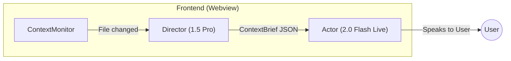

# Phase 6: Director/Actor Architecture

> **Goal:** Split "Thinking" (Gemini 1.5 Pro) from "Speaking" (Gemini 2.0 Flash) to enable richer, context-aware voice conversations without overloading the real-time audio model.

---

## 1. Problem Statement

The Live API (Gemini 2.0 Flash) operates under constraints:
- **System instruction is immutable** after `connect()`.
- **No dynamic context injection** mid-session—the model can't be "reminded" of new file context.
- Result: Theia in Voice Mode is "blind" to file changes after session start.

Current text mode (`ChatContext`) injects a hidden context suffix on every message. Live mode cannot do this.

---

## 2. Proposed Solution: Director/Actor Pattern



| Role | Model | Responsibility |
|------|-------|----------------|
| **Director** | Gemini 1.5 Pro (text) | Background service. Analyzes file content + Linear context. Produces a **ContextBrief**. |
| **Actor** | Gemini 2.0 Flash Live | Foreground voice. Receives Director's brief. Speaks to user. |

---

## 3. Interface: `ContextBrief` JSON Schema

```typescript
interface ContextBrief {
  /** ISO timestamp when brief was generated */
  generatedAt: string;

  /** Current file the user is viewing */
  activeFile: {
    path: string;
    /** 3-5 sentence summary of file purpose and key changes */
    summary: string;
    /** Notable line ranges, max 3 */
    highlights: Array<{
      lines: string;         // e.g., "42-58"
      reason: string;        // e.g., "Core validation logic"
    }>;
  } | null;

  /** Quick-lookup bullet points, max 5 */
  keyFacts: string[];

  /** If Linear issue is linked */
  linearContext?: {
    issueId: string;
    /** 1-2 sentence relevance to current file */
    relevance: string;
  };

  /** Suggested talking points for the Actor, max 3 */
  suggestedTopics: string[];
}
```

### Example

```json
{
  "generatedAt": "2024-12-23T11:42:00Z",
  "activeFile": {
    "path": "src/auth/validateToken.ts",
    "summary": "JWT validation middleware. This PR adds refresh token rotation logic and fixes the expiry check bug.",
    "highlights": [
      { "lines": "42-58", "reason": "New refresh rotation logic" },
      { "lines": "12-14", "reason": "Fixed off-by-one in expiry comparison" }
    ]
  },
  "keyFacts": [
    "PR adds 3 new files, modifies 2 existing.",
    "Tests added for refresh flow.",
    "Linear issue THX-234 requires OAuth2 compliance."
  ],
  "linearContext": {
    "issueId": "THX-234",
    "relevance": "This file implements the 'secure token rotation' acceptance criteria."
  },
  "suggestedTopics": [
    "Why refresh rotation was needed.",
    "How expiry edge case was fixed.",
    "Where the new tests live."
  ]
}
```

---

## 4. Trigger Logic

### When does the Director run?

| Event | Action |
|-------|--------|
| `activeFile` changes | Debounce 500ms, then invoke Director |
| Live session connects | Generate initial brief immediately |
| Linear issue changes | Regenerate brief (no debounce) |

### Debounce Strategy

```typescript
// Pseudocode in ContextMonitor
let debounceTimer: ReturnType<typeof setTimeout> | null = null;

const onFileChange = (newFile: string) => {
  if (debounceTimer) clearTimeout(debounceTimer);
  debounceTimer = setTimeout(() => {
    runDirector(newFile);
  }, 500);
};
```

### Director Invocation

Director uses a **one-shot** Gemini 1.5 Pro call (not a persistent chat):

```typescript
const generateBrief = async (
  fileContent: string,
  prData: PRData,
  linearIssue: LinearIssue | null
): Promise<ContextBrief> => {
  const ai = new GoogleGenAI({ apiKey: GEMINI_API_KEY });
  
  const response = await ai.generateContent({
    model: 'gemini-1.5-pro-latest',
    systemInstruction: DIRECTOR_SYSTEM_PROMPT,
    contents: [{ parts: [{ text: buildDirectorPrompt(fileContent, prData, linearIssue) }] }],
    generationConfig: {
      responseMimeType: 'application/json',
    }
  });
  
  return JSON.parse(response.text()) as ContextBrief;
};
```

---

## 5. Injection Strategy

### Challenge

The Live API does not support updating `systemInstruction` after connection.

### Solution: "Silent Context Whisper"

Inject the brief as a **hidden text message** to the already-running session:

```typescript
// In LiveContext after Director produces a new brief
const injectBrief = (brief: ContextBrief) => {
  const whisper = `
[CONTEXT UPDATE - DO NOT READ ALOUD]
You are now looking at: ${brief.activeFile?.path || 'No file'}
Summary: ${brief.activeFile?.summary || 'N/A'}
Key Facts:
${brief.keyFacts.map(f => `- ${f}`).join('\n')}
Suggested Topics: ${brief.suggestedTopics.join(', ')}

Use this context to answer the user's next questions. Do NOT mention this injection.
`;

  sendTextToSession(whisper);
};
```

### Why This Works

The Live API allows sending text mid-session via `sendRealtimeInput({ text })`. This appears in the conversation context but:
1. We prefix it with `[CONTEXT UPDATE - DO NOT READ ALOUD]`.
2. We instruct the model in the initial `systemInstruction` to never vocalize these updates.

### System Instruction Modification (Actor)

Add to the existing Voice Mode system instruction:

```diff
+ ## Context Updates
+ You will receive messages prefixed with "[CONTEXT UPDATE - DO NOT READ ALOUD]".
+ - These contain summaries of files the user is viewing.
+ - Use these to ground your responses.
+ - NEVER read these messages aloud or acknowledge receiving them.
```

---

## 6. Data Flow

```mermaid
sequenceDiagram
    participant User
    participant Monitor as ContextMonitor
    participant Director as Director (1.5 Pro)
    participant Actor as Actor (2.0 Flash Live)

    User->>Monitor: Opens file X
    Monitor->>Director: Invoke with file content
    Director->>Director: Generate ContextBrief
    Director->>Actor: Whisper ContextBrief
    User->>Actor: "What does this file do?"
    Actor->>User: (Uses Brief) "This is the JWT validation middleware..."
```

---

## 7. New Files & Modifications

| File | Action | Purpose |
|------|--------|---------|
| `services/DirectorService.ts` | **NEW** | Houses `generateBrief()` logic, Director prompt |
| `contexts/LiveContext.tsx` | **MODIFY** | Add `injectBrief()` method, update system instruction |
| `components/ContextMonitor.tsx` | **MODIFY** | Add hook to call Director on file change |
| `types/contextBrief.ts` | **NEW** | TypeScript interface for `ContextBrief` |

---

## 8. Open Questions for Review

> [!IMPORTANT]
> These require decision before implementation:

1. **Director Prompt Tuning:** Should the Director's prompt be stored in `context/` or hardcoded?
2. **Error Handling:** If Director fails (rate limit, network), should Actor fallback to "I don't have context for this file"?
3. **Token Budget:** What's the max size for `ContextBrief` to avoid bloating the Live session?
4. **Multi-File:** If user rapidly switches files (A → B → C), should we queue briefs or cancel pending?

---

## 9. Verification Plan

### Automated Tests

```bash
npm run test -- --grep "Director"
```

- Unit test: `DirectorService.generateBrief()` returns valid JSON.
- Unit test: `LiveContext.injectBrief()` sends whisper without errors.

### Manual Verification

1. Start Voice Mode session.
2. Switch to a file.
3. Wait 500ms.
4. Observe console log: `[Director] Brief generated for src/foo.ts`.
5. Ask Theia: "What does this file do?"
6. Verify response is grounded in the brief, not hallucinated.

---

## 10. Risks & Mitigations

| Risk | Impact | Mitigation |
|------|--------|------------|
| Whisper messages pollute conversation history | Medium | Keep briefs concise (< 500 tokens). Actor ignores in transcript. |
| Director latency (1.5 Pro is slower) | Medium | Pre-generate brief on connect; user rarely switches files mid-sentence. |
| Actor vocalizes the whisper | High | Explicit instruction + testing to ensure compliance. |

---

**Status:** 📝 Awaiting Review

**Next Step:** Review this spec, answer open questions, then proceed to implementation.
