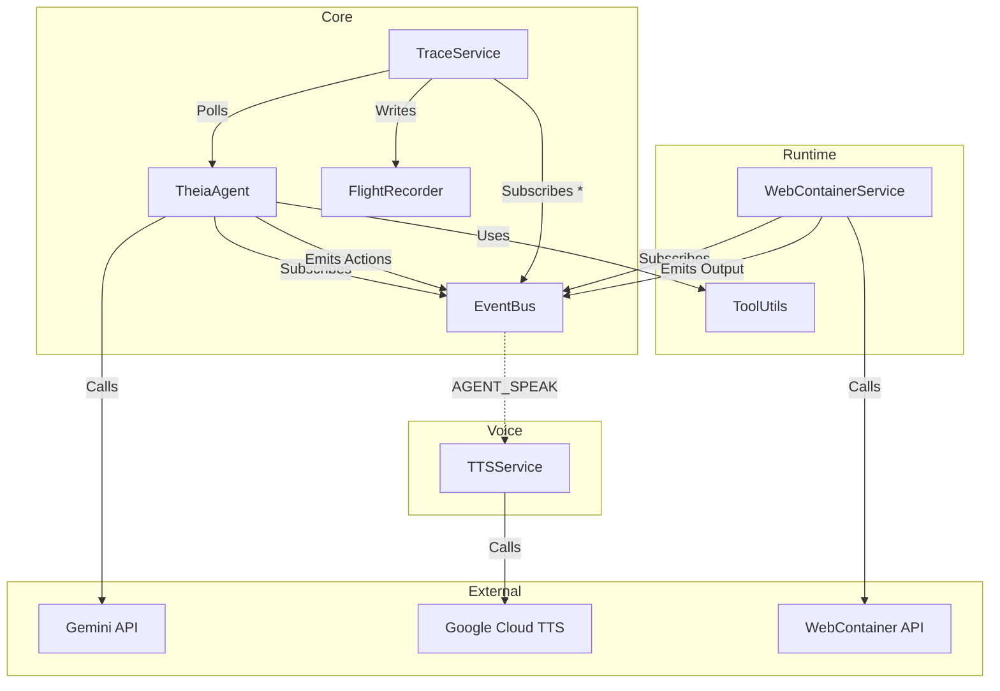

# Dependency Graph Analysis

## Module Relationships

### Core Module (`src/modules/core/`)
*   **`Agent.ts` (The Brain)**
    *   Imports: `EventBus` (Communication), `Runtime/ToolUtils` (Command Formatting), `Search` (Knowledge), `Persistence` (State).
    *   Dependencies: `GoogleGenAI` (LLM), `LangGraph` (State Machine).
    *   **Central Node:** Orchestrates the system by consuming events and emitting actions.

*   **`EventBus.ts` (The Nervous System)**
    *   Imports: `types.ts`
    *   **Hub Node:** Almost all other modules import `EventBus` to subscribe or emit.
    *   Circular Dependency Risk: Low (Singleton pattern, event-based decoupling).

*   **`TraceService.ts` (The Observer)**
    *   Imports: `Agent` (to poll state), `EventBus` (to listen), `FlightRecorder` (to save).
    *   Unidirectional: Observes `Agent` and `EventBus`, writes to `FlightRecorder`.

*   **`FlightRecorder.ts`**
    *   Imports: `types.ts`.
    *   Stand-alone persistence utility.

### Runtime Module (`src/modules/runtime/`)
*   **`WebContainerService.ts` (The Legs)**
    *   Imports: `EventBus`, `@webcontainer/api`.
    *   **Bridge:** Connects `AGENT_EXEC_CMD` events to the WebContainer engine.

### Voice Module (`src/modules/voice/`)
*   **`TTSService.ts` (The Mouth)**
    *   Imports: None (Pure service).
    *   Used By: `LiveContext` (presumably), or event consumers handling `AGENT_SPEAK`.

## Structural Diagram (Mermaid)

## Critical Paths
1.  **Command Execution:** `Agent` -> `ToolUtils` (Format) -> `EventBus` (`AGENT_EXEC_CMD`) -> `WebContainerService` -> `EventBus` (`RUNTIME_OUTPUT`) -> `Agent`.
2.  **Reasoning:** `EventBus` (`USER_MESSAGE`) -> `Agent` -> `Gemini API` -> `Agent` -> `EventBus` (`AGENT_SPEAK`/`AGENT_NAVIGATE`).
3.  **Observability:** `EventBus` (`*`) -> `TraceService` -> `FlightRecorder`.
