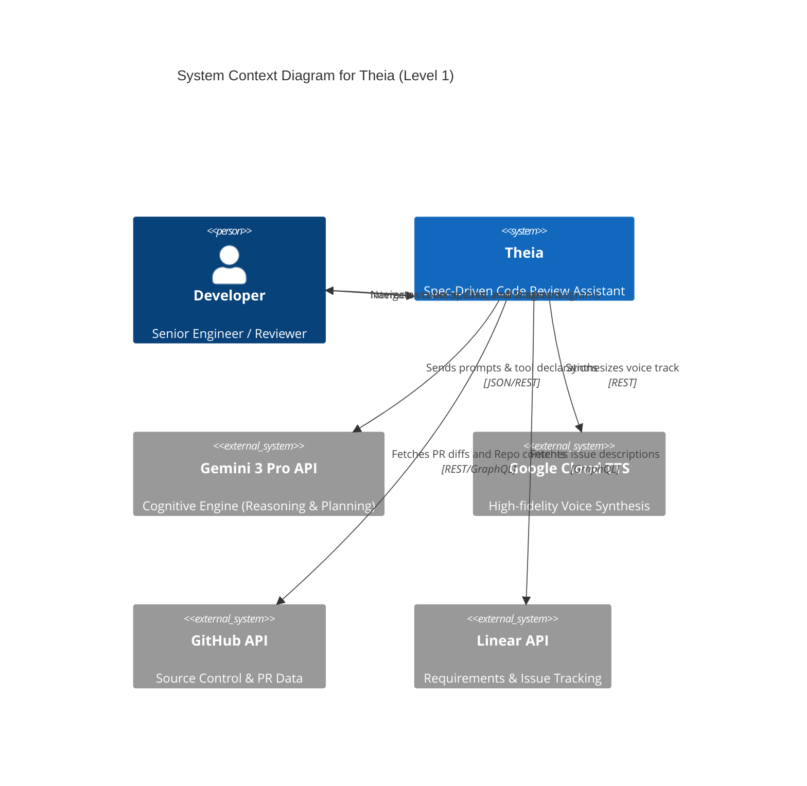
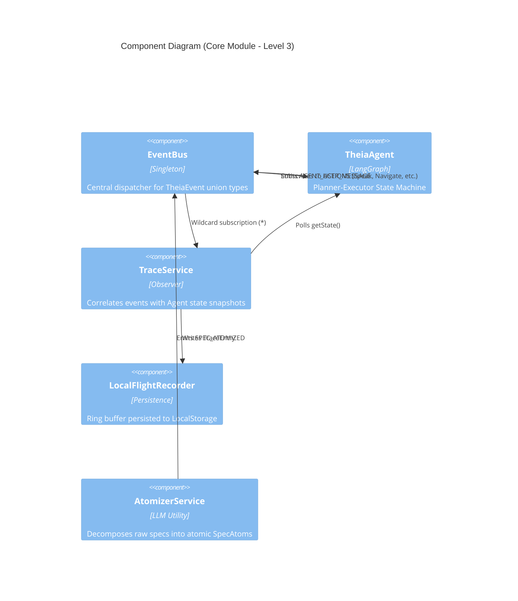
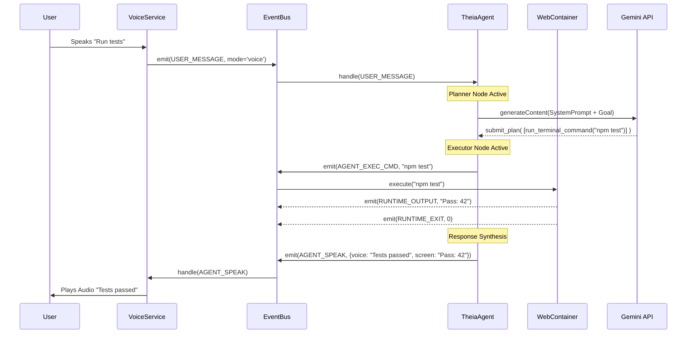
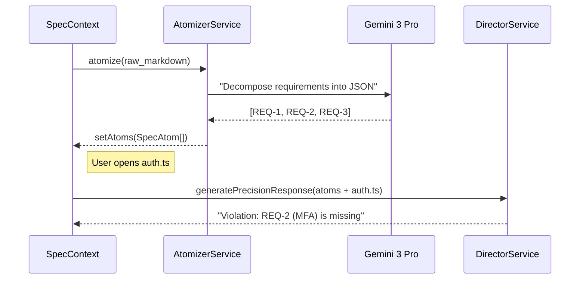
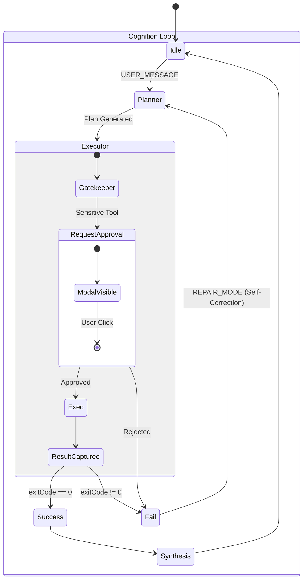
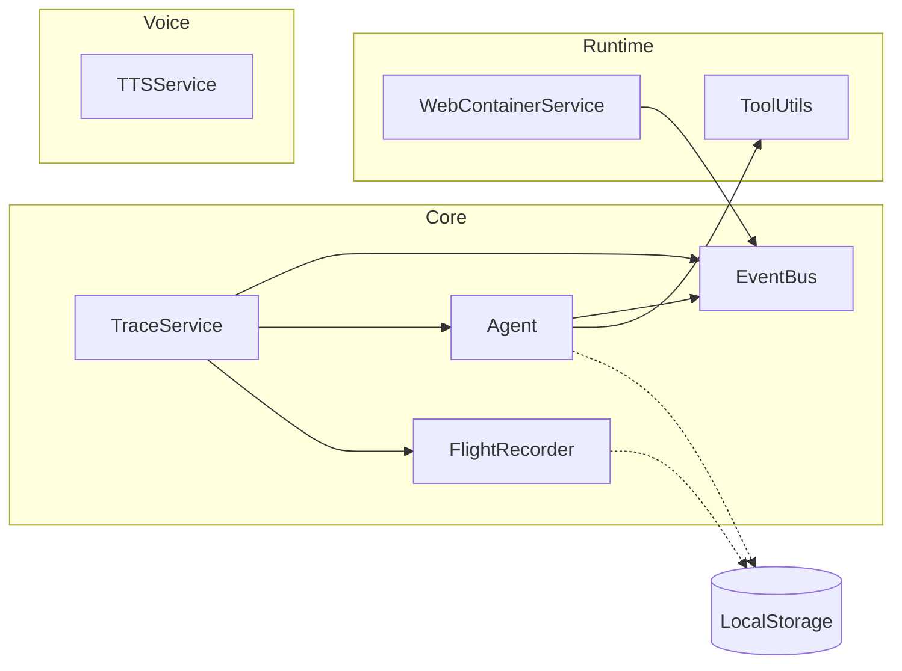

# TH-ARC-01: System Architecture & C4 Model

## 1. MISSION STATEMENT
The architecture of **Theia** is designed for **Observable Autonomy**. It utilizes an Event-Driven, Director-Actor model to bridge the gap between human intent (Voice/Text) and machine execution (Sandbox).

---

## 2. C4 MODEL: LEVEL 1 (System Context)
Theia acts as an intelligent intermediary between the Developer and the project ecosystem.



---

## 3. C4 MODEL: LEVEL 2 (Container Diagram)
The system is divided into three primary execution domains within the browser workstation.

```mermaid
C4Container
    title Container Diagram for Theia (Level 2)

    Person(user, "Developer")

    Container_Boundary(workstation, "Browser Workstation") {
        Container(ui, "UI Layer (React/Vite)", "TypeScript, Tailwind", "Renders Editor, Diagrams, and Chat")
        Container(agent, "Control Plane (LangGraph)", "LangChain, EventBus", "Orchestrates reasoning loops and tool execution")
        Container(sandbox, "Runtime Sandbox (WebContainers)", "StackBlitz WebContainers", "Executes Node.js, Shell, and Tests")
        Container(observability, "Black Box (Observability)", "Ring Buffer, FlightRecorder", "Traces all events and agent states")
    }

    Rel(user, ui, "Speaks/Types/Clicks")
    Rel(ui, agent, "Emits USER_MESSAGE / UI_INTERACTION", "EventBus")
    Rel(agent, ui, "Emits AGENT_SPEAK / AGENT_NAVIGATE", "EventBus")
    Rel(agent, sandbox, "Emits AGENT_EXEC_CMD", "EventBus")
    Rel(sandbox, agent, "Emits RUNTIME_OUTPUT", "EventBus")
    
    UpdateRelTag("EventBus", $textColor="blue", $lineColor="blue")
```

---

## 4. C4 MODEL: LEVEL 3 (Component Diagram - Core Module)
The "Nervous System" and "Brain" components that drive the logic.



---

## 5. DYNAMIC MODELS: SEQUENCE DIAGRAMS

### 5.1 The Voice-Command Loop (The "Neural Loop")
How a spoken command manifests as code execution and voice response.



### 5.2 Spec-Driven Verification Flow (Phase 7)
Grounding the agent in requirements.



---

## 6. STATE MACHINE: AGENT COGNITION
The `TheiaAgent` uses a recursive state machine for self-correction and human-in-the-loop gating.



---

## 7. BLOCK DIAGRAM: MODULE DEPENDENCIES
Illustrates the "Operation Glass Box" architecture.



---

## 8. DEPLOYMENT ARCHITECTURE
Theia is **Local-First** but relies on high-intelligence cloud primitives.

```mermaid
deployment
    title Deployment Architecture

    node "User Browser" {
        artifact "Vite Bundle" <<UI / Agent>>
        node "Worker Thread" {
            artifact "WebContainer Process"
        }
        database "IndexedDB / LocalStorage" <<Persistence>>
    }

    node "Google Cloud" {
        service "Gemini 3 Pro"
        service "Text-to-Speech API"
    }

    node "GitHub" {
        service "GitHub REST/GraphQL"
    }

    node "Linear" {
        service "Linear GraphQL"
    }
```

---
**Status:** ARCHITECTURE DESIGN COMPLETE
**Generated:** 2026-01-25
**Artifact ID:** TH-ARC-01
