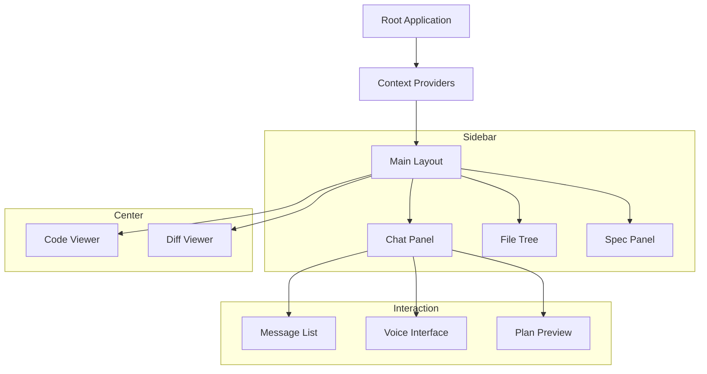

# TH-FDD-03: UI/UX Guidelines & Component Hierarchy

## 1. DESIGN PHILOSOPHY

### 1.1 Voice-First UX
The UI must be secondary to the voice experience. Users should be able to navigate and review code hands-free.
*   **Aural Feedback:** All major system transitions (thinking, success, failure) should be audible.
*   **Dual-Track Rendering:** Text displayed in chat must match the voice track in intent but can include technical details (code blocks) that the voice omits.

### 1.2 The Shadow Partner (Focus Control)
The system should never "steal" the user's attention.
*   **Focus Locking:** If a user is typing in the editor, the Agent must not scroll or switch files, even if a navigation command was issued.
*   **Silent Context:** Context updates (navigation, selection) happen silently in the background without UI flicker.

### 1.3 Operation Glass Box (Observability)
Every decision made by the Agent must be visible on request.
*   **Thinking Signals:** Show the current "Thinking" stage (Planning, Executing, Analyzing).
*   **Traceability:** A dedicated panel to view the event history (The "Black Box").

---

## 2. COMPONENT HIERARCHY

---

## 3. STATE MANAGEMENT (REACT CONTEXTS)

| Context | Responsibility |
| :--- | :--- |
| **ChatContext** | Manages message history and user input state. **Dumb Terminal:** Only renders, does not reason. |
| **LiveContext** | The Bridge to the Agent. Manages TTS, thinking indicators, and EventBus subscriptions. |
| **PRContext** | Manages PR metadata, diffs, and active file content. |
| **SpecContext** | Manages loaded specifications and the atomized checklist. |

---

## 4. VISUAL STYLE & FEEDBACK

### 4.1 The Hybrid File Tree
*   **Hot Nodes:** Solid text. Files that are changed in the PR or manually loaded.
*   **Ghost Nodes:** Dimmed/Italic text. Files that exist in the repo but are not "local" yet.
*   **Interaction:** Clicking a Ghost Node shows a loading spinner *on the node* while the Git fetch occurs.

### 4.2 Permission Modals (Gatekeeper)
*   **Style:** High-contrast overlay.
*   **Content:** Must display the exact bash command or code diff.
*   **Rationale:** Displays the Agent's reasoning: *"I need to fix the import error to run the tests."*

### 4.3 Thinking Indicators
*   **Pulsing State:** A subtle pulse or wave in the chat input when the Agent is reasoning.
*   **Stage Labels:** Display "Planning...", "Executing Command...", "Analyzing Result...".

---

## 5. ACCESSIBILITY & PERFORMANCE
*   **Barge-In:** Audio playback must stop immediately when the user clicks the microphone or starts typing.
*   **Lazy Loading:** Code viewer must use a virtualized list or optimized rendering for large files.
*   **Latency:** All UI transitions must happen within < 100ms of an EventBus signal.

---
**Status:** UI/UX DESIGN COMPLETE
**Generated:** 2026-01-25
**Artifact ID:** TH-FDD-03
