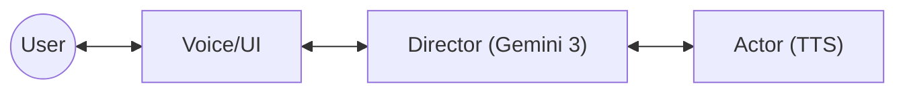
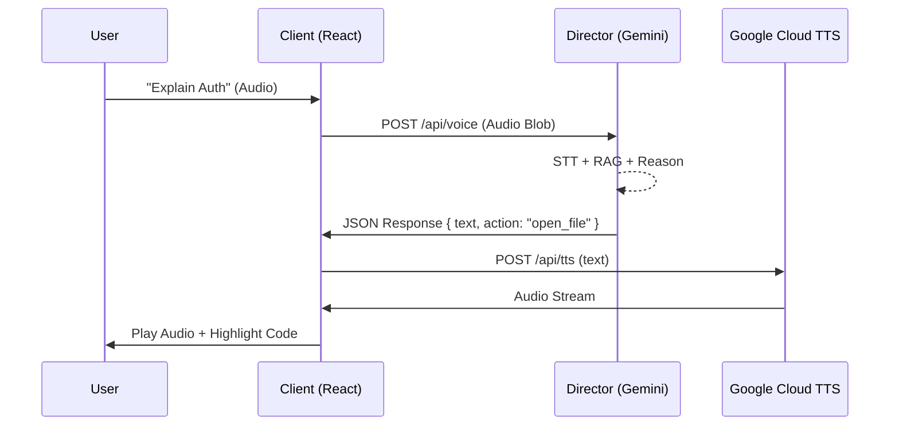

# Architecture: Theia (v0.3.0)
> *Goal: The technical blueprint.*

## System Context

## Voice Command Flow

## Application State
Theia uses a **Hybrid State Model**:
*   **`PRContext`**: Holds the "Target" (the PR/files being reviewed).
    *   *LazyRepo*: On-demand file fetching.
    *   *LinearTickets*: Linked requirements.
*   **`LiveContext`**: Holds the "Session" (Voice/AI interaction).
    *   *Transcript*: Chat history.
    *   *DirectorState*: Listening/Processing/Speaking.

## Component Map
*   **SourceView:** The main code viewer. Supports "Read-Only" mode for non-PR files.
*   **LinearPanel:** The "Spec" sidebar. Lists tickets and verification status.
*   **DiagramPanel:** The "Map". Renders interactive Mermaid diagrams.
    *   *Note:* Uses `DiagramParser` to handle `§filepath:line` clicks.

## Key Patterns
*   **Director/Actor:** The Brain (JSON) vs. The Voice (Audio).
*   **Hexagonal Spec Engine:** Adapters (Linear/File) -> Atomizer -> Context.
*   **The Lazy Graph:** Hybrid State (`prFiles` + `repoTree`) for handling large repos.

## Tech Stack
*   **Frontend:** React, Vite, Tailwind
*   **AI:** Gemini 3 Pro
*   **Voice:** Google Cloud TTS
