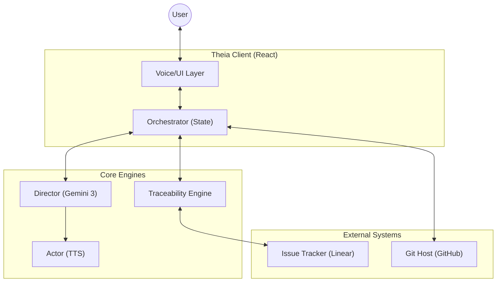
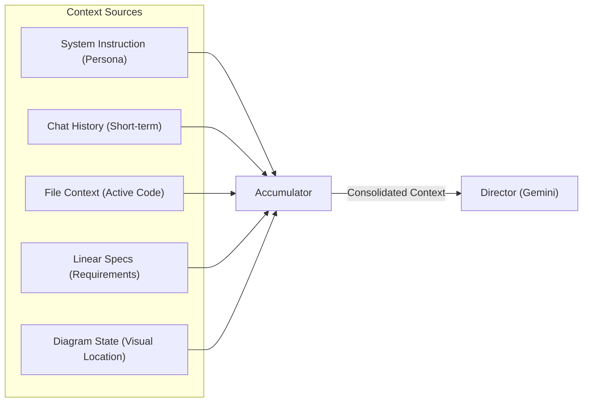
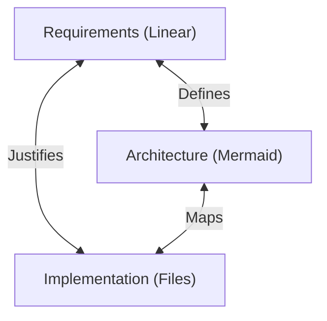

# Architecture: Theia (v0.3.0)
> *The Blueprint for Spec-Driven Autonomy.*

## 1. System Overview (L1)
Theia acts as an intelligent layer between the Developer and the Codebase, facilitating a conversation grounded in specifications.



### Core Flow
1.  **Input:** User speaks or clicks a diagram node.
2.  **Orchestration:** The `PRContext` determines state (File, Spec, Layout).
3.  **Reasoning:** The `Director` receives the Context + Intent.
4.  **Feedback:** The System responds via Voice (`Actor`) or UI updates (Navigation/Highlighting).

---

## 2. The Agent: "Theia Core" (L2)
The Agent is not just a chatbot; it is a context-aware **Director** that commands the UI.

### The Brain (Context Injection)
Theia's intelligence comes from the **Context Engine**, which acts as an accumulator to build the "Prompt Object" for the LLM.



#### Context Components
1.  **System Instruction:** Defines the "Senior Staff Engineer" persona. Enforces brevity and strict adherence to provided tools.
2.  **Chat History:** Last 10 turns of conversation (User <-> Agent).
3.  **File Context:** The content of the file currently open in `SourceView`. *Crucial:* If the file is large, we only send the visible viewport +/- 50 lines (Context Window Optimization).
4.  **Linear Specs:** The specific requirements (tickets) associated with the current PR or file.
5.  **User State:** "User is selecting lines 12-15 in `AuthService.ts`".

### The Director-Actor Handshake (Dual-Track)
We separate **Reasoning (Director)** from **Speech (Actor)** to prevent the AI from reading code blocks aloud.

**The Flow:**
1.  **Input:** User Audio -> STT -> Text.
2.  **Thinking (Director):** Gemini processes the *Consolidated Context*.
3.  **Output (Director):** Returns a JSON object:
    ```json
    {
      "voice": "The error handling is missing here.",
      "screen": {
        "action": "highlight_lines",
        "payload": { "file": "auth.ts", "lines": [15, 16] }
      }
    }
    ```
4.  **Execution (Actor):**
    *   **Voice Track:** Sends `voice` string to Google Cloud TTS -> Audio Stream.
    *   **Screen Track:** Orchestrator executes `highlight_lines` -> UI updates immediately.

```mermaid
sequenceDiagram
    participant User
    participant Browser
    participant Director
    participant Actor

    User->>Browser: "Does this handle the Auth Error?"
    Browser->>Director: POST /api/chat (Context + Audio)
    Director->>Director: Analyze Code vs Spec
    Director->>Browser: JSON { "speak": "No...", "screen": { "action": "highlight" } }
    par Voice Track
        Browser->>Actor: POST /api/tts ("No...")
        Actor->>Browser: Audio Stream
    and Screen Track
        Browser->>Browser: CodeViewer.highlight(15)
    end
    Browser->>User: Audio Playback + Visual Highlight
```

### Agent Capabilities (Tools)
The Director has access to a specific toolset to manipulate the "World":
*   `speak(text)`: Generate audio response.
*   `navigate(file_path)`: Open a file in the code viewer.
*   `highlight(lines)`: Visually emphasize code blocks.
*   `query_repo(pattern)`: Lazy-fetch files from the git tree (for exploration).
*   `verify_spec(atom_id)`: Mark a requirement as "Verified" in the Traceability Engine.

---

## 3. The Traceability Engine (L2)
This is the "Golden Thread" that justifies code existence by connecting it to requirements.

### The Connectivity Triangle
We verify correctness by triangulating three sources of truth.



### How Verification Works
1.  **Selection:** User selects a block of code or a file.
2.  **Fetch Requirement:** Theia looks up the linked Linear Ticket.
3.  **Atomization:** The Requirement is broken down into "Spec Atoms" (Individual assertions).
4.  **Verification:** The `Director` verifies: `Does Code X satisfy Spec Atom Y?`
5.  **Result:** Pass/Fail with explanation.

---

## 4. Key Technical Decisions
*   **Lazy Graph:** We fetch the Repo Tree first, then fetch File Blobs *on-demand*. This supports massive repos without full cloning.
*   **Hexagonal Specs:** The Spec Engine is an adapter. We can swap Linear for Jira or GitHub Issues without changing the verification logic.
*   **Hybrid Diagrams:** We use static Mermaid for rendering speed but overlay unseen HTML click handlers to make the diagram interactive.
