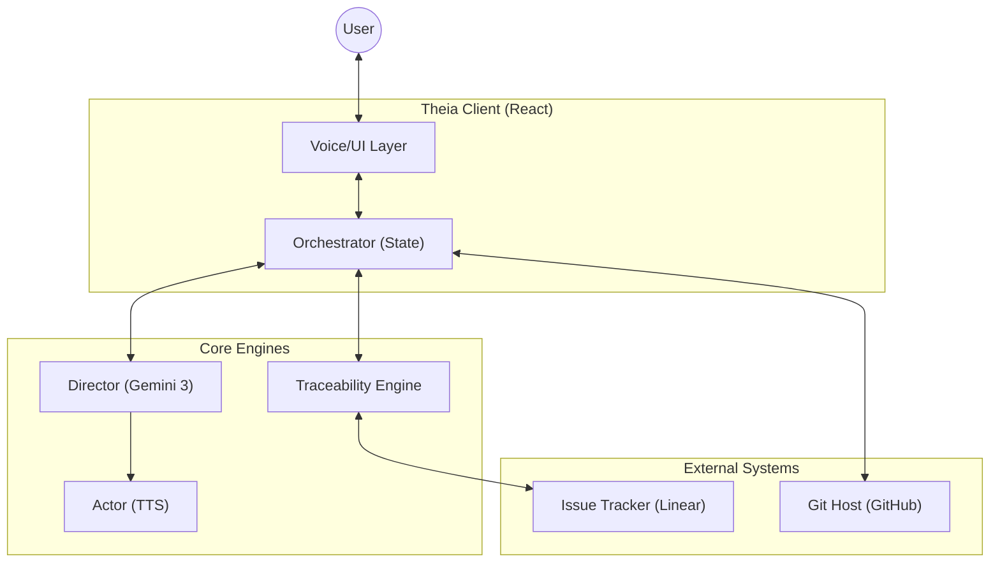
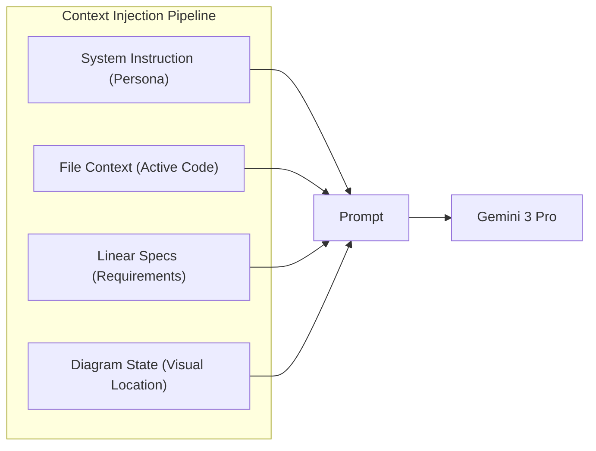
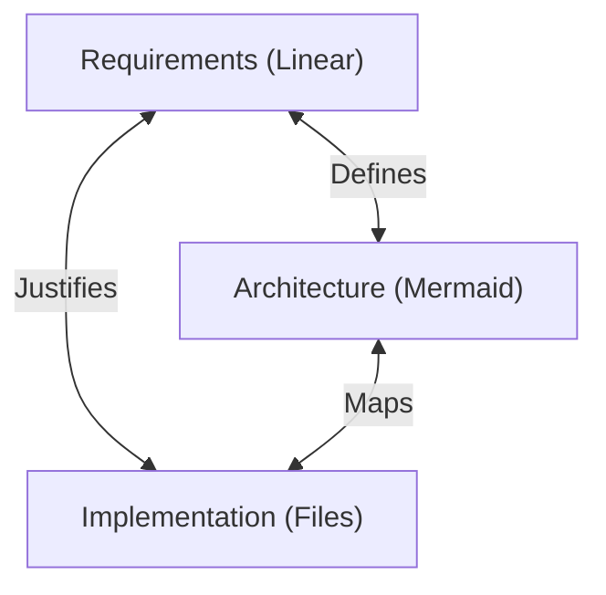

# Architecture: Theia (v0.3.0)
> *The Blueprint for Spec-Driven Autonomy.*

## 1. System Overview (L1)
Theia acts as an intelligent layer between the Developer and the Codebase, facilitating a conversation grounded in specifications.



### Core Flow
1.  **Input:** User speaks or clicks a diagram node.
2.  **Orchestration:** The `PRContext` determines state (File, Spec, Layout).
3.  **Reasoning:** The `Director` receives the Context + Intent.
4.  **Feedback:** The System responds via Voice (`Actor`) or UI updates (Navigation/Highlighting).

---

## 2. The Agent: "Theia Core" (L2)
The Agent is not just a chatbot; it is a context-aware **Director** that commands the UI.

### The Brain (Context Injection)
Theia's intelligence comes from how we assemble the prompt. We don't just dump code; we construct a precise **Context Object**.



*   **System Instruction:** Enforces the "Senior Staff Engineer" persona (Direct, Concise).
*   **File Context:** The active file's content (Lazy Loaded).
*   **Linear Specs:** The acceptance criteria for the feature code is actively implementing.
*   **Diagram State:** "Where am I in the map?" (Architecture grounding).

### The Voice Loop (Director/Actor)
We separate **Reasoning (Director)** from **Speech (Actor)** to prevent the AI from reading code blocks aloud.

```mermaid
sequenceDiagram
    participant User
    participant Browser
    participant Director
    participant Actor

    User->>Browser: "Does this handle the Auth Error?"
    Browser->>Director: POST /api/chat (Context + Audio)
    Director->>Director: Analyze Code vs Spec
    Director->>Browser: JSON { "speak": "No, it's missing try/catch.", "action": "highlight_line(15)" }
    Browser->>Actor: POST /api/tts ("No, it's missing...")
    Actor->>Browser: Audio Stream
    Browser->>User: Plays Audio & Highlights Line 15
```

---

## 3. The Traceability Engine (L2)
This is the "Golden Thread" that justifies code existence by connecting it to requirements.

### The Connectivity Triangle
We verify correctness by triangulating three sources of truth.



### How Verification Works
1.  **Selection:** User selects a block of code or a file.
2.  **Fetch Requirement:** Theia looks up the linked Linear Ticket.
3.  **Atomization:** The Requirement is broken down into "Spec Atoms" (Individual assertions).
4.  **Verification:** The `Director` verifies: `Does Code X satisfy Spec Atom Y?`
5.  **Result:** Pass/Fail with explanation.

---

## 4. Key Technical Decisions
*   **Lazy Graph:** We fetch the Repo Tree first, then fetch File Blobs *on-demand*. This supports massive repos without full cloning.
*   **Hexagonal Specs:** The Spec Engine is an adapter. We can swap Linear for Jira or GitHub Issues without changing the verification logic.
*   **Hybrid Diagrams:** We use static Mermaid for rendering speed but overlay unseen HTML click handlers to make the diagram interactive.
