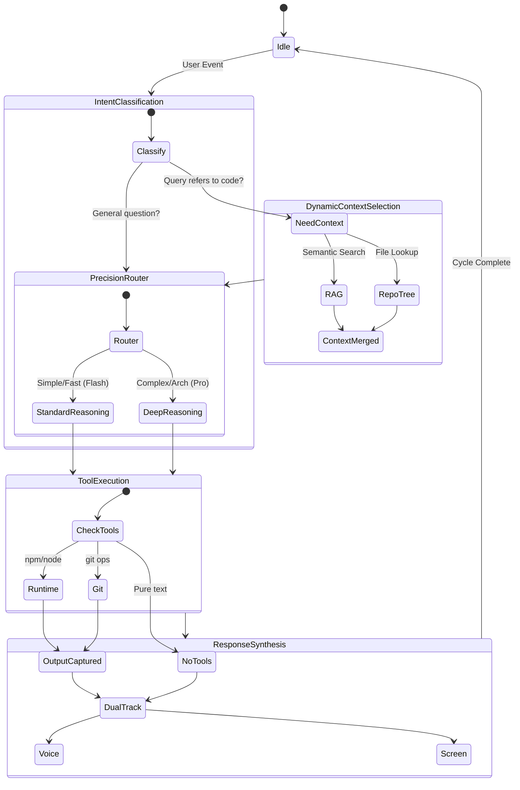

# 02. Agentic Orchestrator (L2)
> *The Brain: LangGraph Control Plane*

## Core Concept: The State Machine
We use **LangGraph.js** to model the AI as a state machine, replacing the ad-hoc "Director" logic. This ensures deterministic control flow, identifying when to search for context, when to reason, and when to execute code.

## State Graph

## Key Modules

### 1. Intent Classification
First, we classify the user's intent. Is this a casual greeting, a specific question about a file, or a request to run tests?
*   **Input:** User Message + Active View
*   **Output:** `IntentType` (CodeQuery, Command, ChitChat)

### 2. Dynamic Context Selection
Unlike the previous "Context Consolidator" which blindly dumped 50kb of text, the **Context Selector** is intelligent.
*   **Mechanism:**
    *   If query mentions "auth", it pulls `auth.ts` (Active Fetch).
    *   If query implies "tests", it looks for `*.spec.ts`.
    *   It uses the **Lazy Graph** to fetch only what is needed.

### 3. Precision Router
Decides which model to use based on complexity:
*   **Standard Reasoning (Gemini 2.5 Flash):** Fast, low latency. Good for simple explanations or single-file edits.
*   **Deep Reasoning (Gemini 3 Pro):** High intelligence. Required for architectural decisions, refactoring, or complex debugging.

### 4. Tool Execution (The Arms)
The Agent can now *do* things, not just suggest them.
*   **Runtime:** Executes code in the **Runtime Sandbox**.
*   **Git:** Performs git operations.
*   **Output:** The stdout/stderr is captured and fed back into the synthesis layer.

### 5. Response Synthesis
Merges the reasoning, tool outputs, and context into the final **Dual-Track Response** (Voice + Screen), ensuring the user sees the code and hears the summary.
