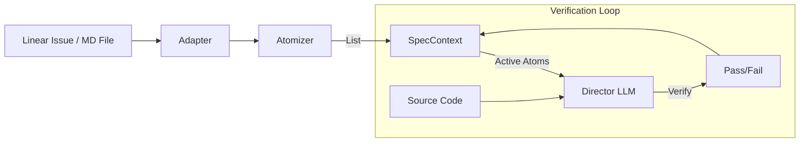

# 03. Traceability Engine (L2)
> *The Eyes: Spec-Driven Verification*

## Core Concept: Hexagonal Adapters
The Traceability Engine is agnostic to *where* specs come from. It uses an **Adapter Pattern** to standardize requirements into `SpecAtoms`.

*   **Port:** `SpecAdapter` Interface.
*   **Adapters:** `LinearAdapter`, `FileAdapter`, `ManualAdapter`.

## Source of Truth
*   `src/contexts/SpecContext.tsx`: The state machine.
*   `src/services/AtomizerService.ts`: The logic that breaks large documents into "Atoms".

## Data Structure: `SpecAtom`
The atomic unit of a requirement.

```typescript
interface SpecAtom {
  /** Unique ID (e.g., "AUTH-001") */
  id: string;
  
  /** The specific requirement text */
  description: string;
  
  /** Category (Security, Performance, Logic) */
  category: string;
  
  /** Current verification state */
  status: 'pending' | 'verified' | 'violated';
  
  /** Reference to the source (e.g., line number in MD, Issue ID) */
  sourceRef: string;
}
```

## The Verification Flow



## Context Integration
When `SpecContext` has an active spec, it injects the *pending atoms* directly into the `SystemInstruction` of the Director. This forces the AI to check every code verification against the active checklist.
