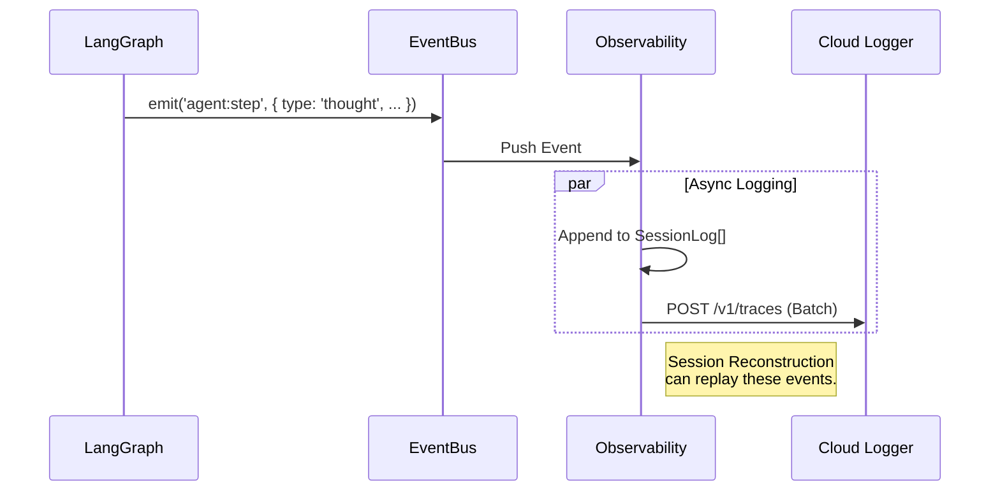

# 04. Observability Layer (L2)
> *The Black Box Recorder: Tracing & Analysis*

## Core Concept: Root Cause Analysis
With an autonomous agent, "why did it do that?" is the most important question. The Observability Layer captures every thought, decision, and toll output.

## Data Structure: The TraceSpan
Every action is recorded as a `TraceSpan`.

```typescript
interface TraceSpan {
  id: string;
  parentId?: string; // For nested steps
  type: 'thought' | 'tool' | 'context' | 'error';
  timestamp: number;
  
  // What happened?
  name: string; // e.g., "RunTest", "SelectContext"
  
  // Data Payload
  input: any;
  output: any;
  
  // Performance
  latencyMs: number;
  
  // Metadata
  modelConfig?: {
    model: 'gemini-2.0-flash' | 'gemini-1.5-pro';
    temperature: number;
  };
}
```

## The Event Flow
The `EventBus` works as the central nervous system.



## Debugging UI
The "Trace View" in the client allows developers (and the user) to expand a timeline of the Agent's reasoning:
1.  **Intent:** "User asked to fix bug."
2.  **Context:** "Loaded `Main.tsx`."
3.  **Reasoning:** "Saw error on line 40."
4.  **Tool:** "Ran `npm test` -> Failed."
5.  **Output:** "Proposed fix."
