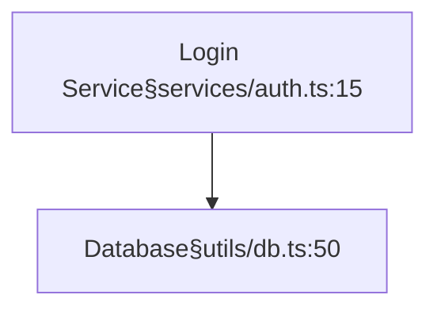
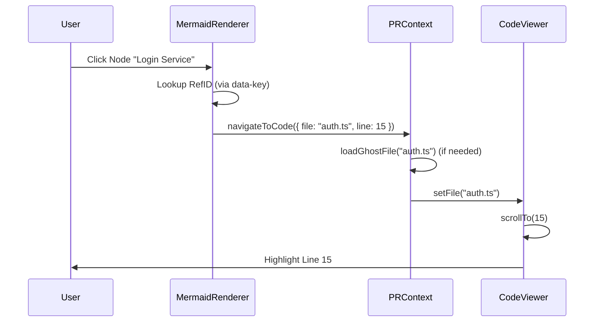

# 04. Visual Navigation (L2)
> *The Map: Diagram-Driven Context*

## Core Concept: `§filepath:line` Parse Strategy
We embed navigation metadata directly into Mermaid node labels using a custom syntax `§path:line`. This allows the diagram to act as a functional map without complex external mapping files.

## Source of Truth
*   `src/services/DiagramParser.ts`: Regex-based parser.
*   `src/contexts/PRContext.tsx`: Handles the navigation execution.

## The Syntax
Input in Mermaid:

## Parsing Logic (`DiagramParser.ts`)
1.  **Regex Match:** `([^§\[\]]+)§([^:\s\]]+):(\d+)`
2.  **Extraction:**
    *   Label: `Login Service`
    *   Path: `services/auth.ts`
    *   Line: `15`
3.  **Cleaning:** The parser removes the `§...` part from the `cleanedSource` so the rendered diagram looks clean to the user.
4.  **Indexing:** A map of `RefID -> { path, line }` is created.

## Click Handling Flow

