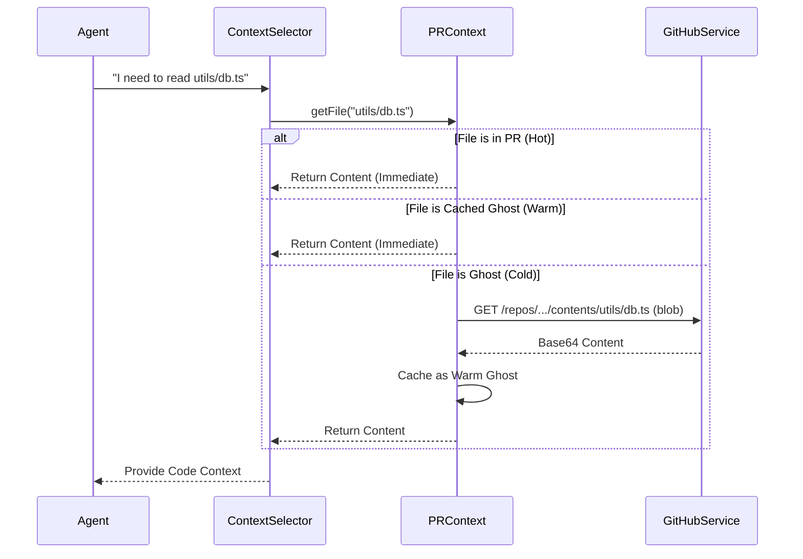

# 05. Full Repo Data (L2)
> *The Territory: Infinite Exploration & Lazy Loading*

## Core Concept: Phase 9 "Lazy Graph" Strategy
In Phase 9, we implemented a **Hybrid Data Loading Strategy** to enable "Full Repo Access" without the performance penalty of cloning massive repositories (e.g., 10GB monorepos) into the browser.

We define three types of node availability:
1.  **PR Files (Hot):** Files actively modified in the Pull Request. Always loaded, writable, and high-priority.
2.  **Repo Metadata (Warm):** A lightweight JSON tree structure of the *entire* repository. Loaded once at startup (~200ms). Contains paths and SHAs but *no content*.
3.  **Ghost Nodes (Cold):** Files that exist in the tree but have no content loaded.

## The Lazy Loading Mechanism
When the Agent or User navigates to a file not in the PR:

1.  **Discovery:** The file appears in the file tree (ghosted) based on the "Warm" metadata.
2.  **On-Demand Fetch:**
    *   **User Action:** Clicking a file executes a `fetchContent(path)` call.
    *   **Agent Action:** The `ContextSelector` requests `getContent(path)`.
3.  **Caching:** The fetched content is cached in memory. It becomes "Warm" for the rest of the session but remains "Read-Only" (unless explicit edit permission is granted).

## Data Structures

```typescript
type NodeStatus = 'hot' | 'warm' | 'ghost';

interface LazyFile {
  path: string;
  content: string | null; // Null for Ghost Nodes
  sha: string; // From GitHub Tree API
  size: number;
  status: NodeStatus;
  
  // UX State
  isReadOnly: boolean;
  fetchedAt?: number;
}

interface RepoState {
  prFiles: Map<string, LazyFile>; // The "Working Set"
  treeCache: Map<string, FileMetadata>; // The "Map"
  ghostFiles: Map<string, LazyFile>; // The "Explored Territory"
}
```

## Sequence Diagram



## Benefits
*   **Performance:** Instant startup time regardless of repo size.
*   **Memory:** Only loads what is actually read.
*   **Context Window:** Prevents flooding the LLM context with irrelevant files.
