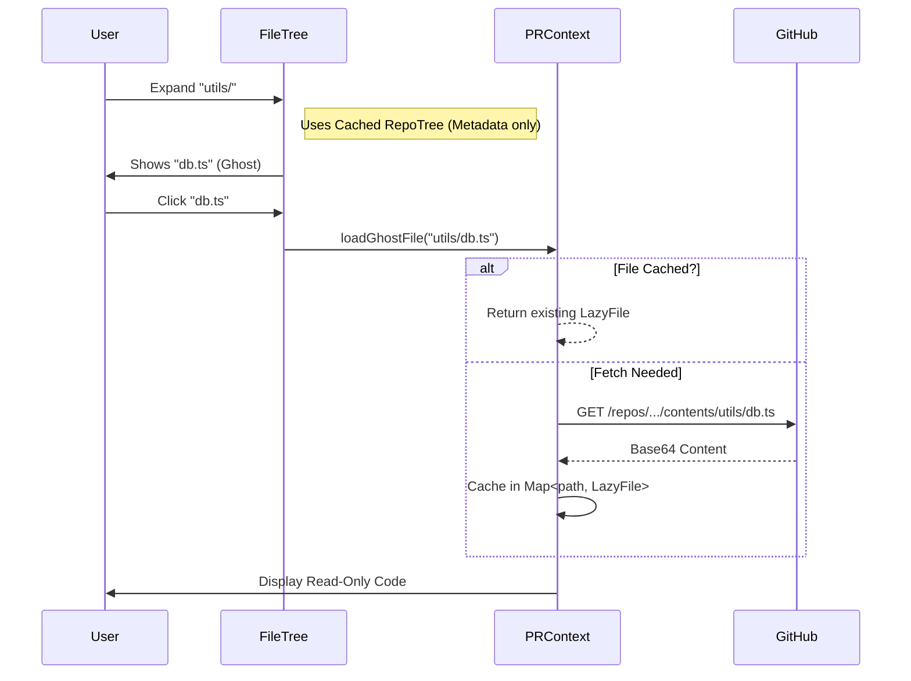

# 05. Lazy Repo Graph (L2)
> *The Territory: Infinite Exploration*

## Core Concept: Hybrid State (`PR + Repo`)
To avoid the cost of cloning a full 10GB repo, we maintain a **Hybrid State**:
1.  **PR Files:** The small set of changed files (Always loaded).
2.  **Repo Tree:** A lightweight JSON tree of the *entire* repo (Loaded once).
3.  **Ghost Nodes:** Files fetched individually *on-demand*.

## Source of Truth
*   `src/contexts/PRContext.tsx`: Manages the state.
*   `src/services/github.ts`: API wrapper.
*   `src/components/FileTree/FileTree.tsx`: Visualizer.

## Data Structures

```typescript
interface LazyFile {
  path: string;
  content: string | null; // Null if not yet fetched
  sha: string;
  isReadOnly: boolean; // True for Ghost Nodes, False for PR files
  fetchedAt: number;
}
```

## The Lazy Loading Sequence



## Ghost Nodes vs. PR Nodes
| Feature | PR Node (Changed) | Ghost Node (Unchanged) |
| :--- | :--- | :--- |
| **Source** | `prData.files` | `github.fetchFile` |
| **Edit Mode** | Read/Comment | Read-Only |
| **Highlighting** | Diff Green/Red | Standard Syntax |
| **Availability** | Immediate | Async (Active Fetch) |
