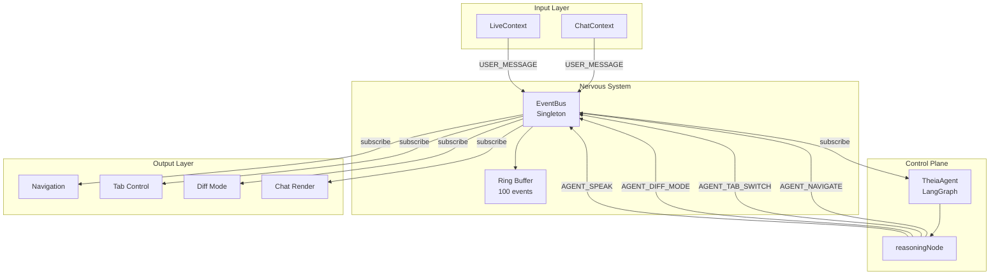
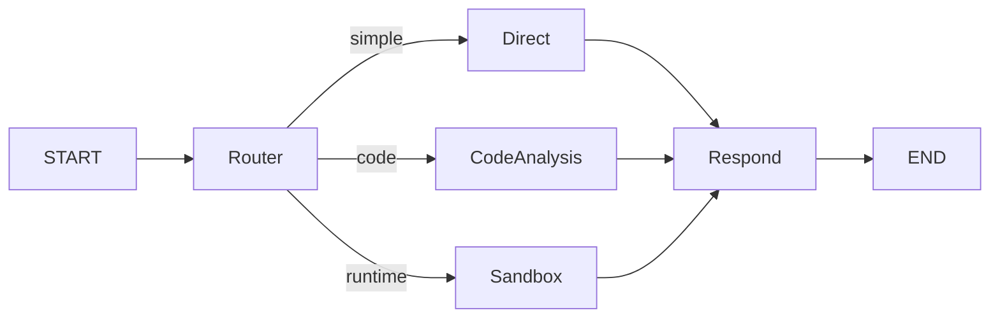

# 06: Event-Driven Core (The Nervous System)

> **Phase 10 Implementation** | v0.4.0 "Neural Loop"

## Overview

The Event-Driven Core is the central nervous system of Theia. It decouples all components through a pub/sub EventBus architecture, enabling:

1. **Testability** - Components can be tested in isolation
2. **Observability** - All events are logged to a ring buffer
3. **Extensibility** - New handlers subscribe without modifying existing code



---

## The EventBus Pattern

**File:** `src/modules/core/EventBus.ts`

### Design Principles

| Principle | Implementation |
|-----------|----------------|
| **Singleton** | Single `eventBus` instance exported |
| **Type-Safe** | `TheiaEvent` union type for all events |
| **Observable** | Ring buffer stores last 100 events |
| **Decoupled** | Publishers don't know subscribers |

### Ring Buffer (Black Box)

```typescript
private readonly HISTORY_SIZE = 100;
private history: EventEnvelope[] = [];
private historyIndex = 0;
```

The ring buffer enables:
- **Post-mortem debugging** - Inspect what happened before a crash
- **Test verification** - Assert events were emitted
- **Audit trail** - Track all agent actions

### API

```typescript
// Subscribe to specific event type(s)
eventBus.subscribe('AGENT_NAVIGATE', handler);
eventBus.subscribe(['AGENT_SPEAK', 'AGENT_THINKING'], handler);
eventBus.subscribe('*', wildcardHandler); // All events

// Emit an event
eventBus.emit({ type: 'USER_MESSAGE', payload: {...} });

// Observability
eventBus.getHistory();           // All events (chronological)
eventBus.getRecentEvents(10);    // Last N events
eventBus.getEventsByType('AGENT_NAVIGATE');
```

---

## The Protocol (types.ts)

**File:** `src/modules/core/types.ts`

### UserIntent (Input Signals)

Events emitted by the UI toward the Agent:

| Type | Purpose |
|------|---------|
| `USER_MESSAGE` | Text/voice input from user |
| `UI_INTERACTION` | Clicks, selections, toggles |
| `CODE_CHANGE` | Navigation, annotation events |

### AgentAction (Output Signals)

Events emitted by the Agent toward the UI:

| Type | Handler | Effect |
|------|---------|--------|
| `AGENT_SPEAK` | ChatContext | Render message |
| `AGENT_NAVIGATE` | `navigateToCode()` | Switch file + scroll |
| `AGENT_TAB_SWITCH` | `setLeftTab()` | Change sidebar tab |
| `AGENT_DIFF_MODE` | `setIsDiffMode()` | Toggle diff view |
| `AGENT_THINKING` | `setIsTyping()` | Show loading state |

---

## The Agent State Machine

**File:** `src/modules/core/Agent.ts`

### LangGraph Architecture

```typescript
const graph = new StateGraph<AgentState>({
    channels: {
        messages: { reducer: (x, y) => x.concat(y) },
        context: { reducer: (x, y) => y },  // Latest wins
        prData: { reducer: (x, y) => y }
    }
});

graph.addNode("reasoning", this.reasoningNode.bind(this));
graph.addEdge("start", "reasoning");
graph.addEdge("reasoning", END);
```

### Single Node Design (Phase 10)

Currently a single `reasoningNode` handles:
1. Context injection (hidden system message)
2. LLM call with tool declarations
3. **Tool Loop** - Execute tools until text response

```
┌────────────────────────────────────────┐
│              reasoningNode              │
├────────────────────────────────────────┤
│ 1. Inject context suffix               │
│ 2. Send to Gemini                      │
│ 3. WHILE functionCalls exist:          │
│    a. executeTool() → emit event       │
│    b. Build functionResponse           │
│    c. Send responses back to Gemini    │
│ 4. Extract final text                  │
│ 5. Emit AGENT_SPEAK                    │
└────────────────────────────────────────┘
```

### Tool Loop (The Hands)

```typescript
private executeTool(name: string, args: any): void {
    switch (name) {
        case 'navigate_to_code':
            eventBus.emit({ type: 'AGENT_NAVIGATE', payload: {...} });
            break;
        case 'change_tab':
            eventBus.emit({ type: 'AGENT_TAB_SWITCH', payload: {...} });
            break;
        case 'toggle_diff_mode':
            eventBus.emit({ type: 'AGENT_DIFF_MODE', payload: {...} });
            break;
    }
}
```

---

## The "Dumb Terminal" Pattern

**File:** `contexts/ChatContext.tsx`

### Why We Decoupled

> **Critical Design Decision:** ChatContext contains **zero LLM logic**.

| Before (Coupled) | After (Decoupled) |
|------------------|-------------------|
| ChatContext called Gemini directly | ChatContext only renders state |
| Tool execution mixed with UI state | Tools emit events, UI subscribes |
| Hard to test (LLM dependency) | Fully testable (inject events) |
| Single point of failure | Isolated failure domains |

### The Contract

ChatContext's only responsibilities:
1. **Emit** `USER_MESSAGE` when user types
2. **Subscribe** to Agent actions
3. **Execute** UI commands blindly

```typescript
// ChatContext subscribes and obeys
eventBus.subscribe('*', (envelope) => {
    if (event.type === 'AGENT_NAVIGATE') {
        navigateToCode(event.payload.target);  // Just do it
    }
    if (event.type === 'AGENT_TAB_SWITCH') {
        setLeftTab(event.payload.tab);         // No questions
    }
    // ...
});
```

### Test Injection Hook

For verification, the EventBus is exposed:

```typescript
if (typeof window !== 'undefined') {
    (window as any).__THEIA_EVENT_BUS__ = eventBus;
}
```

This enables deterministic Playwright tests without LLM dependency.

---

## Verification

**File:** `tests/neural-loop.spec.ts`

21 tests across 3 browsers verify:

| Test | Assertion |
|------|-----------|
| EventBus exposed | `__THEIA_EVENT_BUS__.emit` exists |
| AGENT_NAVIGATE | `selectedFile` updates |
| AGENT_TAB_SWITCH | `leftTab` changes |
| AGENT_DIFF_MODE | `isDiffMode` toggles |
| Event history | Ring buffer records events |
| USER_MESSAGE | Event propagates through bus |
| AGENT_SPEAK | Message renders in chat |

---

## Future Evolution (Phase 11+)

The single-node Agent will evolve into a multi-node graph:



The EventBus pattern remains unchanged - only the Agent's internal graph evolves.
