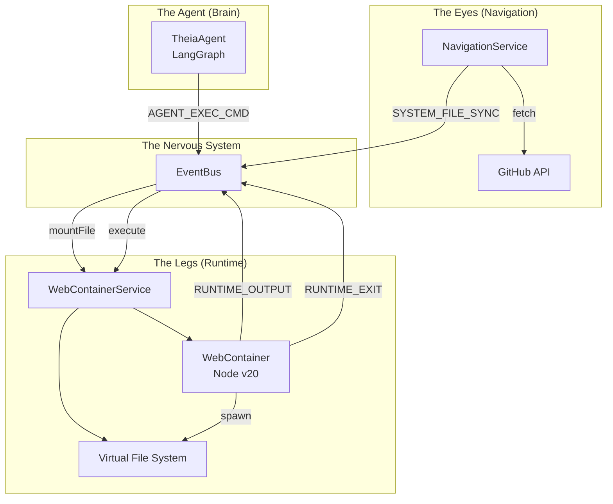
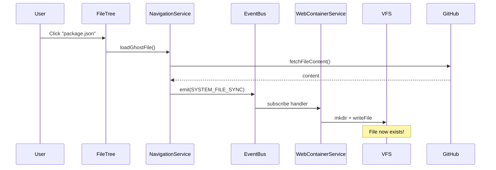
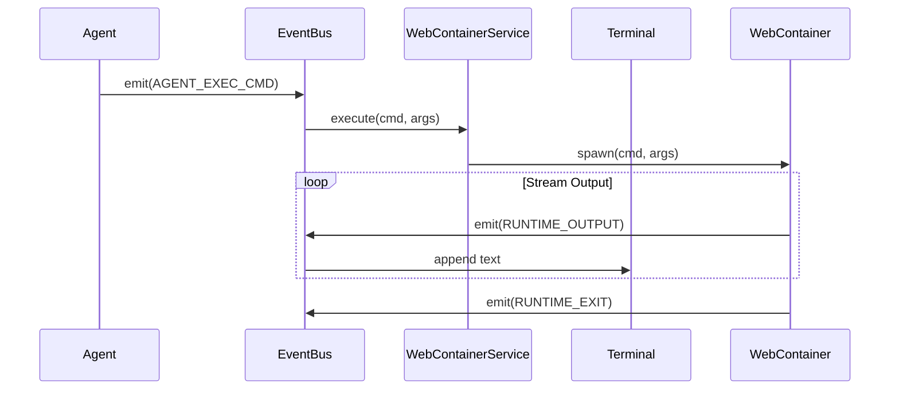

# 07: Runtime Sandbox (The Legs)

> **Phase 11 Implementation** | v0.5.0 "The Sandbox Update"

## Overview

The Runtime Sandbox gives Theia the ability to **execute code** in a secure, browser-native Node.js environment. Using StackBlitz's WebContainers API, the Agent can:

1. **Run commands** (`npm install`, `node script.js`, `ls -la`)
2. **Stream output** to a visible terminal
3. **React to file navigation** via automatic mounting



---

## Security Model

### Cross-Origin Isolation

WebContainers require Cross-Origin Isolation (COI) headers. We use the **`credentialless`** strategy:

```typescript
// vite.config.ts
headers: {
    'Cross-Origin-Opener-Policy': 'same-origin',
    'Cross-Origin-Embedder-Policy': 'credentialless',
}
```

| Strategy | Trade-off |
|----------|-----------|
| `require-corp` | Strictest, but breaks external resources |
| **`credentialless`** | Allows external resources, still secure |
| `none` | No isolation, WebContainers won't boot |

### Sandbox Boundaries

| Scope | Access |
|-------|--------|
| File System | Virtual only (VFS in browser memory) |
| Network | Outbound HTTP allowed (for `npm install`) |
| Host System | **Zero access** - fully browser-sandboxed |
| Secrets | Never exposed to container |

---

## The File Sync Bridge

### Problem

The Agent has "Eyes" (NavigationService with GitHub data) and "Legs" (WebContainer runtime), but they were disconnected. The VFS started empty.

### Solution: `SYSTEM_FILE_SYNC`

A reactive event that bridges Navigation → Runtime:



### Implementation

**Transmitter** (`NavigationService.ts`):
```typescript
const content = await this.github.fetchFileContent(...);
// ... update lazyFiles state ...

// Broadcast to Runtime
eventBus.emit({
    type: 'SYSTEM_FILE_SYNC',
    payload: { path, content }
});
```

**Receiver** (`WebContainerService.ts`):
```typescript
eventBus.subscribe('SYSTEM_FILE_SYNC', async (envelope) => {
    await this.mountFile(envelope.event.payload.path, 
                         envelope.event.payload.content);
});

public async mountFile(path: string, content: string) {
    const parts = path.split('/');
    parts.pop(); // filename
    const dir = parts.join('/');
    
    if (dir) await this.instance.fs.mkdir(dir, { recursive: true });
    await this.instance.fs.writeFile(path, content);
}
```

---

## Command Execution Flow

### AGENT_EXEC_CMD → Shell

When the Agent decides to run a command:



### Tool Definition

```typescript
{
    name: 'run_terminal_command',
    description: 'Execute a shell command in the sandbox',
    parameters: {
        command: { type: 'string' },
        args: { type: 'array', items: { type: 'string' } }
    }
}
```

---

## Polyfills & Patches

### AsyncLocalStorage

LangGraph.js uses `AsyncLocalStorage` which doesn't exist in browsers. We polyfill it:

```typescript
// src/polyfills/async-local-storage.ts
if (typeof window !== 'undefined' && !globalThis.AsyncLocalStorage) {
    globalThis.AsyncLocalStorage = class AsyncLocalStorage<T> {
        private store: T | undefined;
        run<R>(store: T, callback: () => R): R {
            this.store = store;
            return callback();
        }
        getStore(): T | undefined { return this.store; }
    };
}
```

### Node Built-ins

WebContainers provide Node.js runtime, but our *host* app (Vite) also needs polyfills:

```typescript
// vite.config.ts
resolve: {
    alias: {
        'async_hooks': 'src/polyfills/async-hooks.ts'
    }
}
```

---

## Event Types

**File:** `src/modules/core/types.ts`

| Event | Direction | Purpose |
|-------|-----------|---------|
| `AGENT_EXEC_CMD` | Agent → Runtime | Request command execution |
| `RUNTIME_OUTPUT` | Runtime → UI | Stream stdout/stderr |
| `RUNTIME_EXIT` | Runtime → Agent | Command completed |
| `RUNTIME_READY` | Runtime → System | Container booted / server ready |
| `SYSTEM_FILE_SYNC` | Navigation → Runtime | Mount file to VFS |

---

## Verification

### Manual Test

1. Navigate to `package.json` in the UI
2. Terminal shows: `[System] Mounted: package.json`
3. Ask Agent: "Run `ls -la`"
4. Terminal shows: `package.json` in listing

### Automated

```typescript
// Inject SYSTEM_FILE_SYNC
eventBus.emit({
    type: 'SYSTEM_FILE_SYNC',
    payload: { path: 'test.txt', content: 'hello' }
});

// Verify mount via AGENT_EXEC_CMD
eventBus.emit({
    type: 'AGENT_EXEC_CMD',
    payload: { command: 'cat', args: ['test.txt'] }
});

// Assert RUNTIME_OUTPUT contains 'hello'
```

---

## Future: The Planner (Phase 12)

With the Sandbox complete, the Agent can now:
- ✅ See files (Navigation)
- ✅ Run code (Runtime)
- ✅ Use tools (LangGraph)

**Next:** Multi-step planning for complex tasks.
