# 08: The Planner (Deliberative Reasoning)

> Phase 12.2-12.6: The Architect's Brain

## Overview

The Theia Agent evolved from a reactive chat-tool system to a **deliberative planning engine** capable of decomposing complex requests into executable steps, observing runtime feedback, and gracefully handling failures.

## Architecture

```mermaid
flowchart TB
    subgraph "The Brain (LangGraph)"
        A[USER_MESSAGE] --> P[🎯 Planner Node]
        P --> |"submit_plan()"| E[⚡ Executor Node]
        E --> |"executeTool()"| O[👁 Observer]
        O --> |"stepResult"| J[⚖️ Judge]
        J --> |"isSuccess?"| R{Router}
        R --> |"continue"| E
        R --> |"abort/complete"| END[END]
    end

    subgraph "Safety Rails"
        G[🛡 Governor] --> |"MAX_STEPS=15"| R
    end
```



## Core Components

### 1. Planner Node (The Architect)

- **Purpose**: Breaks user requests into atomic, executable steps
- **Tool**: `submit_plan(goal, steps[])`
- **Output**: `AgentPlan` with `status: 'planning' -> 'executing'`

```typescript
// Planner creates structured plans
const plan: AgentPlan = {
  goal: "Run tests and report results",
  steps: [
    { description: "Run npm test", tool: "run_terminal_command" },
    { description: "Navigate to failing test", tool: "navigate_to_code" }
  ],
  activeStepIndex: 0,
  status: 'executing'
};
```

### 2. Executor Node (The Hands)

- **Purpose**: Executes the current step using bound tools
- **Tools**: `run_terminal_command`, `navigate_to_code`, `change_tab`, `toggle_diff_mode`
- **Key**: Uses `executeCommandAndWait()` for synchronous terminal feedback

### 3. Observer (The Eyes) - Phase 12.4

The Observer closes the feedback loop by capturing runtime output:

```typescript
private async executeCommandAndWait(command: string, args: string[]): Promise<string> {
  // 1. Subscribe to RUNTIME_OUTPUT and RUNTIME_EXIT events
  // 2. Emit AGENT_EXEC_CMD
  // 3. Wait for exit signal
  // 4. Return captured stdout/stderr + exit code
}
```

### 4. Judge (The Conscience) - Phase 12.5

Analyzes step results and decides whether to continue or abort:

```typescript
// Extract exit code from output
const exitCodeMatch = stepResult.match(/\[Exit Code: (\d+)\]/);
const isSuccess = exitCode === 0;

if (!isSuccess) {
  // STOP IMMEDIATELY - Graceful Failure
  updatedPlan.status = 'failed';
}
```

### 5. Governor (Safety Rail) - Phase 12.6

Prevents infinite loops by enforcing a hard execution limit:

```typescript
private routePlan(state: AgentState): string {
  const MAX_STEPS = 15;
  if (plan && plan.activeStepIndex > MAX_STEPS) {
    console.warn('[Governor] Max steps exceeded. Aborting.');
    return END;
  }
  // ... continue routing logic
}
```

## Event Flow

| Phase | Event | Direction |
|-------|-------|-----------|
| Input | `USER_MESSAGE` | UI → Agent |
| Plan | `AGENT_PLAN_CREATED` | Agent → UI |
| Execute | `AGENT_EXEC_CMD` | Agent → Runtime |
| Observe | `RUNTIME_OUTPUT/EXIT` | Runtime → Agent |
| Output | `AGENT_SPEAK` | Agent → UI |

## Graceful Failure Logic

1. **Step Fails** → Exit code != 0
2. **Judge Detects** → Sets `step.status = 'failed'`
3. **Plan Aborts** → `plan.status = 'failed'`
4. **Router Exits** → Returns `END` instead of looping
5. **User Notified** → `AGENT_SPEAK` with failure message

## Key Design Decisions

1. **Synchronous Feedback**: The Observer pattern ensures terminal output is captured before the next step runs.

2. **Early Abort**: Failures stop execution immediately rather than cascading into more failures.

3. **Hard Limits**: The Governor prevents runaway execution regardless of plan length.

4. **Event-Driven**: All components communicate via the EventBus (Nervous System).

## Files

| File | Purpose |
|------|---------|
| [`Agent.ts`](file:///src/modules/core/Agent.ts) | LangGraph state machine |
| [`types.ts`](file:///src/modules/planner/types.ts) | `AgentPlan`, `PlanStep` interfaces |
| [`EventBus.ts`](file:///src/modules/core/EventBus.ts) | Central event router |
