# 09: Self-Correction (The Refiner)

> Phase 13: Cognitive Resilience

## Overview

The Theia Agent achieved **Cognitive Resilience** through a Self-Correction Loop. When execution fails, instead of crashing or stopping permanently, the Agent captures the error, re-routes to the Planner, and generates a repair plan.

## The "Fail-Fix" Architecture

```mermaid
flowchart LR
    subgraph "The Self-Correction Loop"
        E[⚡ Executor] -->|"Step Fails"| J[⚖️ Judge]
        J -->|"Capture Error"| R{Router}
        R -->|"status: failed"| P[🎯 Planner]
        P -->|"Repair Plan"| E2[⚡ Executor]
        E2 -->|"Retry"| J
    end
    
    R -->|"status: completed"| END[END]
```



## Core Mechanism

### 1. Trauma Capture (State)

The Agent's state now carries "memory" of failures:

```typescript
interface AgentState {
  // ... existing fields
  lastError?: string;  // The captured error output
}
```

When a step fails, the Executor captures the terminal output (including error messages) and injects it into state:

```typescript
if (!isSuccess) {
  return {
    plan: { ...plan, status: 'failed' },
    lastError: stepResult  // "npm ERR! ..."
  };
}
```

### 2. Route Diversion (Governor)

The Router detects the failure and redirects to the Planner:

```typescript
private routePlan(state: AgentState): string {
  if (plan && plan.status === 'failed') {
    console.log('[Governor] Failure detected. Rerouting to Planner.');
    return "planner";  // Self-correction path
  }
  // ... continue or end
}
```

### 3. Repair Mode (Planner)

The Planner detects "Repair Mode" and injects error context:

```typescript
const isRepairMode = plan && plan.status === 'failed';

if (isRepairMode) {
  systemInstruction += `
    CRITICAL UPDATE: REPAIR MODE
    The previous plan FAILED.
    Failed Step: "${plan.steps[plan.activeStepIndex]?.description}"
    Error Output: "${lastError}"
    
    Create a NEW plan that fixes the error.`;
}
```

## State Flow

| Phase | `plan.status` | `lastError` | Next Route |
|-------|---------------|-------------|------------|
| Initial | `executing` | `undefined` | → executor |
| Success | `executing` | `undefined` | → executor |
| Failure | `failed` | `"Error: ..."` | → planner |
| Repaired | `executing` | `undefined` | → executor |
| Complete | `completed` | `undefined` | → END |

## Event Flow


## Key Design Decisions

1. **Trauma Memory**: The `lastError` field persists the error across graph transitions, enabling informed replanning.

2. **Clean Slate**: After the Planner generates a repair plan, `lastError` is cleared to prevent stale context.

3. **One Retry**: The current implementation attempts one repair cycle. Future versions could implement exponential backoff or multiple strategies.

4. **Graceful Degradation**: If the repair also fails, the loop triggers again (up to MAX_STEPS limit).

## Files

| File | Purpose |
|------|---------|
| [`Agent.ts`](file:///src/modules/core/Agent.ts) | Self-correction logic in `routePlan`, `plannerNode`, `executorNode` |
| [`types.ts`](file:///src/modules/planner/types.ts) | `AgentState.lastError` field |

## Example: Self-Correction in Action

**User Request**: "Run the tests"

1. **Plan Created**: `npm test`
2. **Execution**: Command fails (missing dependency)
3. **Error Captured**: `lastError = "Cannot find module 'jest'"`
4. **Reroute**: Governor sends to Planner
5. **Repair Plan**: `npm install && npm test`
6. **Retry**: Commands succeed
7. **Complete**: Agent reports success
