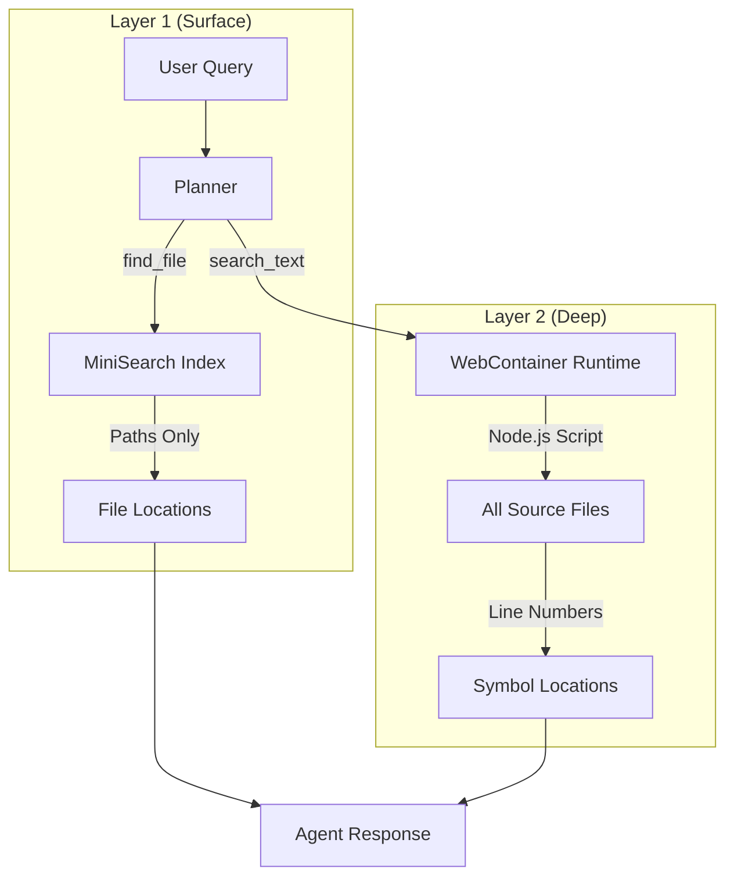
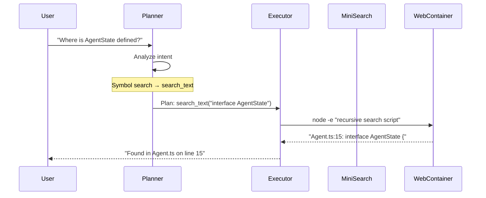

# 10. The Librarian

## Overview

The Librarian is Theia's knowledge retrieval system, enabling the Agent to discover code locations and symbols without consuming API calls. It implements a **Dual-Layer Search Architecture** that balances speed with depth.

## Architecture



## Tools

### `find_file` (Surface Search)

| Aspect | Details |
|--------|---------|
| **Engine** | MiniSearch (UI) |
| **Speed** | Instant (~1ms) |
| **Scope** | File paths only |
| **Use Case** | "Open the Agent class" |

```typescript
// Example
find_file({ name: "Agent" })
// Returns: ["src/modules/core/Agent.ts", "src/components/AgentPanel.tsx"]
```

### `search_text` (Deep Search)

| Aspect | Details |
|--------|---------|
| **Engine** | Node.js in WebContainer |
| **Speed** | Fast (~100-500ms) |
| **Scope** | Full file content |
| **Use Case** | "Where is AgentState defined?" |

```typescript
// Example
search_text({ query: "interface AgentState" })
// Returns: "src/modules/core/Agent.ts:15: interface AgentState {"
```

## Implementation

### SearchService (`src/modules/search/SearchService.ts`)

The `SearchService` is a singleton that maintains a MiniSearch index of all repository files:

```typescript
class SearchService {
  private index: MiniSearch<IndexDocument>;
  
  // Index files from NavigationService
  indexFiles(files: { path: string }[]): void
  
  // Fast filename search
  search(query: string): SearchResult[]
}
```

### Agent Tool Integration (`src/modules/core/Agent.ts`)

The Agent's executor handles both search tools:

```typescript
// Surface Search (UI Index)
if (name === 'find_file') {
  const results = searchService.search(args.name);
  return `Found files:\n` + results.map(r => `- ${r.id}`).join('\n');
}

// Deep Search (Runtime)
if (name === 'search_text') {
  // Uses Node.js script to recursively search files
  // Excludes node_modules and hidden directories
  const command = `node -e "..."`;
  return this.executeCommandAndWait(command, []);
}
```

## Data Flow



## Design Decisions

### Why Two Layers?

1. **Performance**: MiniSearch is instant but only knows paths
2. **Depth**: Node.js search reads file content but takes longer
3. **API Cost**: Zero GitHub API calls - all local to the Runtime

### Why Node.js Instead of grep?

WebContainer's `jsh` shell doesn't include `grep`. Node.js is always available and provides:
- Recursive directory traversal
- File extension filtering (`.ts`, `.js`, `.tsx`, etc.)
- Automatic exclusion of `node_modules` and hidden directories

### Indexing Strategy

Files are indexed when:
1. **On Load**: NavigationService fetches the file tree from GitHub
2. **Path-Only**: Only paths are indexed (not content) to save memory
3. **Lazy Content**: Full content search happens on-demand in Runtime

## Related Modules

- **[SearchService](../../../src/modules/search/SearchService.ts)**: MiniSearch index implementation
- **[NavigationService](../../../src/modules/navigation/NavigationService.ts)**: Triggers indexing on file tree fetch
- **[Agent](../../../src/modules/core/Agent.ts)**: Exposes tools to the Planner
