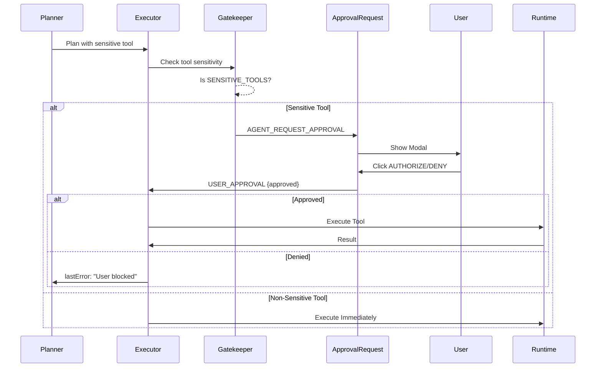

# 11. Human-in-the-Loop: The Gatekeeper

> **Phase 15: The Collaborator**  
> Transform the Agent from an Autonomous Executor to a Co-Pilot under human supervision.

## Overview

The Human-in-the-Loop (HITL) system implements a **permission-based execution model** where sensitive Agent actions require explicit user approval before execution. This transforms Theia from an autonomous actor to a collaborative partner.

## Architecture



## Core Concepts

### The Gatekeeper

The Gatekeeper is a checkpoint within the `executorNode` that intercepts sensitive tool calls before execution:

```typescript
const SENSITIVE_TOOLS = [
  'run_terminal_command',  // Shell execution
  'write_file',            // File creation/modification
  'git_commit',            // Version control (future)
  'git_push'               // Remote operations (future)
];

// In executorNode:
if (SENSITIVE_TOOLS.includes(name)) {
    console.log(`[Gatekeeper] Intercepting: ${name}`);
    
    eventBus.emit({
        type: 'AGENT_REQUEST_APPROVAL',
        payload: { tool: name, args }
    });
    
    return { pendingAction: { tool, args, rationale } };
}
```

### The Handshake

The Handshake is the resume mechanism that unpauses execution after user decision:

1. **User clicks AUTHORIZE** → `USER_APPROVAL { approved: true }`
   - Tool is executed via `executeTool()`
   - Plan step marked as completed/failed
   - Graph resumes from `process()` with cleared `pendingAction`

2. **User clicks DENY** → `USER_APPROVAL { approved: false }`
   - Plan step marked as failed
   - `lastError` set to "User explicitly blocked this action"
   - Graph routes to Planner for self-correction

### The Control Panel

`ApprovalRequest.tsx` provides the UI overlay:

```
┌─────────────────────────────────────┐
│  ⚠️ PERMISSION REQUIRED             │
│                                     │
│  Tool: run_terminal_command         │
│  Args: { command: "rm -rf /" }      │
│                                     │
│         [DENY]    [AUTHORIZE]       │
└─────────────────────────────────────┘
```

## State Management

### AgentState Extension

```typescript
interface PendingAction {
  tool: string;
  args: any;
  rationale: string;
}

interface AgentState {
  // ... existing fields
  pendingAction?: PendingAction;
}
```

### Graph Routing

The `routePlan` method checks for pending actions:

```typescript
private routePlan(state: AgentState): string {
  if (state.pendingAction) {
    console.log('[Governor] Pending action. Pausing.');
    return END; // Halt graph until user decision
  }
  // ... normal routing
}
```

## Event Protocol

| Event | Direction | Payload |
|-------|-----------|---------|
| `AGENT_REQUEST_APPROVAL` | Agent → UI | `{ tool, args }` |
| `USER_APPROVAL` | UI → Agent | `{ approved: boolean }` |

## Security Considerations

1. **Allowlist Model**: Only explicitly listed tools require approval
2. **No Bypass**: The Gatekeeper is integrated into the executor flow
3. **Audit Trail**: All approval requests are logged to console
4. **Fail-Safe**: Denial routes to self-correction, not silent failure

## Known Limitations

- **API Timeouts**: Intermittent Gemini SDK hangs may prevent the modal from appearing
- **No Persistence**: Pending actions are lost on page refresh
- **Single Action**: Only one pending action can exist at a time

## Future Enhancements

- [ ] Granular permission levels (always allow, always deny, ask each time)
- [ ] Action preview with diff visualization
- [ ] Audit log persistence
- [ ] Batch approval for multi-step plans
