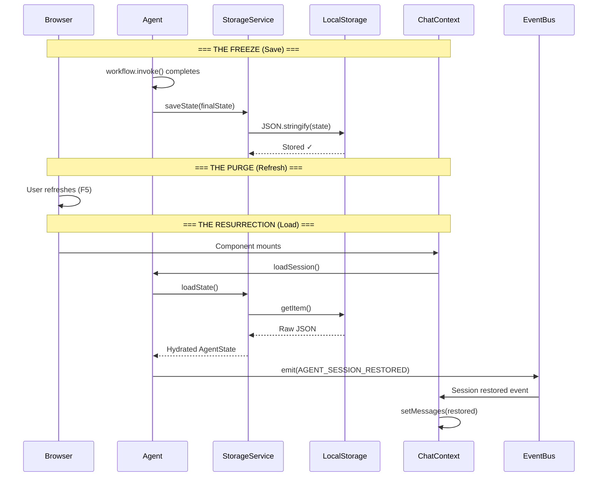

# 12. Session Persistence (The Memory Palace)

**Phase 16 | v1.0.0 "The Immortal"**

## Overview

The Persistence Layer gives the Agent **immortality**—the ability to survive browser refreshes and resume exactly where it left off. This is achieved through a dedicated `StorageService` that serializes `AgentState` to `localStorage`.

## Architecture



## Components

### StorageService (`src/modules/persistence/StorageService.ts`)

The Vault—responsible for freezing and thawing Agent consciousness.

```typescript
class StorageService {
  saveState(state: AgentState)    // Freeze to localStorage
  loadState(): Partial<AgentState> | null  // Thaw from localStorage
  clearState()                    // Memory wipe
  hasSavedState(): boolean        // Check for existing state
}
```

**Storage Key:** `THEIA_AGENT_STATE_V1`

**Persisted Fields:**
- `messages[]` — Chat history
- `context` — UI state snapshot
- `prData` — PR metadata
- `plan` — Execution plan with step statuses
- `pendingAction` — Human-in-the-loop state
- `lastError` — Error context for self-correction
- `savedAt` — Timestamp for debugging

### Agent Integration

The `TheiaAgent` class contains two persistence hooks:

1. **Save Hook** (in `process()` method):
   ```typescript
   const finalState = await this.workflow.invoke(initialState);
   this.state = finalState;
   storageService.saveState(this.state); // <-- Freeze
   ```

2. **Load Hook** (`loadSession()` method):
   ```typescript
   public async loadSession() {
     const saved = storageService.loadState();
     if (saved) {
       this.state = saved as AgentState;
       eventBus.emit({ type: 'AGENT_SESSION_RESTORED', payload: { state } });
     }
   }
   ```

### UI Integration (`ChatContext.tsx`)

The React frontend triggers restoration on mount and listens for the event:

```typescript
useEffect(() => {
  eventBus.subscribe('*', (envelope) => {
    if (event.type === 'AGENT_SESSION_RESTORED') {
      setMessages(state.messages);  // Repaint chat
    }
  });
  
  agent.loadSession();  // Trigger resurrection
}, []);
```

## Event Protocol

| Event | Direction | Purpose |
|-------|-----------|---------|
| `AGENT_SESSION_RESTORED` | Agent → UI | Notify UI to repaint with restored state |

## Serialization Strategy

**Why Not LangChain Message Classes?**

Our `AgentState.messages` are already plain objects `{ role, content }[]`, not LangChain `BaseMessage` instances. This simplifies serialization:

- **Save:** Direct `JSON.stringify()` — no dehydration needed
- **Load:** Direct `JSON.parse()` — no hydration needed

This design decision eliminates class reconstruction complexity and ensures reliable persistence.

## Storage Lifecycle

```
┌─────────────────┐
│   User Action   │
│  (Chat/Plan)    │
└────────┬────────┘
         │
         ▼
┌─────────────────┐
│  Graph Execute  │
│   workflow()    │
└────────┬────────┘
         │
         ▼
┌─────────────────┐
│   Save State    │◄──── Automatic after every run
│  localStorage   │
└─────────────────┘
         │
    [Browser Refresh]
         │
         ▼
┌─────────────────┐
│  Load Session   │◄──── Triggered on mount
│  Restore State  │
└────────┬────────┘
         │
         ▼
┌─────────────────┐
│ Emit Restored   │
│   Event to UI   │
└─────────────────┘
```

## Known Limitations (v1.0.0)

1. **Plan Sidebar Re-render:** The plan state is persisted, but the plan sidebar UI may not automatically repaint (requires `AGENT_PLAN_CREATED` re-emission). Targeted for v1.0.1.

2. **Session Isolation:** Currently uses a single storage key. Multi-PR sessions would require key namespacing.

3. **Storage Quota:** `localStorage` has a ~5MB limit. Extended conversations may require pruning strategy.

## Testing

**The Immortality Test:**
1. Chat: "My secret code is 777."
2. Trigger a plan (e.g., "Create file secret.txt")
3. Hard Refresh (Cmd+Shift+R)
4. Verify: Chat history returns, Agent remembers context

**Console Verification:**
```
[Agent] Attempting to restore session...
[Storage] State loaded. Saved at: 2026-01-10T...
[ChatContext] Session restored from storage
```
