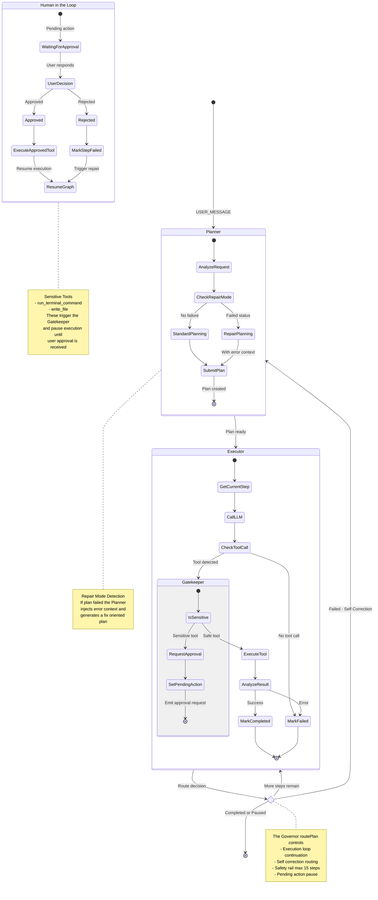

# Theia Agent Execution Flow

This diagram visualizes the internal state machine of the Theia Agent, based on the LangGraph implementation in `src/modules/core/Agent.ts`.



## Key Components

| Component | Location | Purpose |
|-----------|----------|---------|
| **StateGraph** | Lines 166-197 | LangGraph state machine with `messages`, `context`, `prData`, `plan`, `lastError`, `pendingAction` channels |
| **Planner Node** | Lines 445-617 | Generates step-by-step plans; enters Repair Mode when `plan.status === 'failed'` |
| **Executor Node** | Lines 623-830 | Executes current step; invokes Gatekeeper for sensitive tools |
| **routePlan** | Lines 224-264 | Conditional edge logic (Governor) - decides loop/repair/end |
| **Gatekeeper** | Lines 728-745 | Intercepts `SENSITIVE_TOOLS`, emits `AGENT_REQUEST_APPROVAL`, sets `pendingAction` |
| **resolvePendingAction** | Lines 311-408 | Handles `USER_APPROVAL` events to resume or abort execution |

## Execution Paths

### Standard Execution
```
USER_MESSAGE → Planner → Executor → [Loop] → Executor → ... → END
```

### Self-Correction (Repair Mode)
```
Executor (step failed) → Governor → Planner (Repair Mode) → Executor → ...
```

### Human-in-the-Loop
```
Executor → Gatekeeper → pendingAction set → END (paused)
    ↓
USER_APPROVAL event → resolvePendingAction() → Re-invoke graph
```
