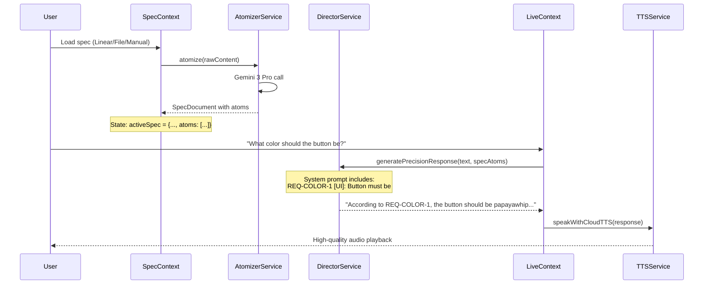

# Phase 7: Spec-Driven Traceability Architecture

**Technical Specification v1.0**

> **Goal:** Transform Theia from "Linear-specific integration" to a **Universal Spec Compliance Engine** that verifies code against granular, source-agnostic requirements (SpecAtoms).

---

## 1. Problem Statement

### What Was the Limitation?

Before Phase 7, Theia's requirement awareness was:
- **Tightly coupled to Linear** - Only understood `linearIssue` objects from the PR context
- **Monolithic** - The entire issue description was injected as one blob
- **Unverifiable** - No structured way to check individual requirements against code
- **Not traceable** - Couldn't cite which specific requirement was implemented or violated

### Why Was the Previous Approach Insufficient?

| Problem | Impact |
|---------|--------|
| Hard-coded Linear dependency | Couldn't use other sources (Jira, Markdown, Manual) |
| Unstructured requirements | LLM couldn't systematically verify each requirement |
| No atomic granularity | Couldn't say "REQ-3 is violated" - only vague assessments |
| Single source | Teams using Markdown specs for acceptance criteria were unsupported |

---

## 2. Architecture & Design

### High-Level Architecture

```mermaid
flowchart TB
    subgraph Sources ["Input Sources"]
        LIN[Linear Issue]
        MD[Markdown File]
        CLIP[Clipboard/Manual]
    end

    subgraph Adapters ["Hexagonal Adapters"]
        LA[LinearAdapter]
        FA[FileAdapter]
    end

    subgraph Core ["Core Engine"]
        SC[SpecContext]
        AT[AtomizerService]
        DS[DirectorService]
    end

    subgraph Output ["Voice Output"]
        LC[LiveContext]
        TTS[TTSService]
    end

    LIN --> LA
    MD --> FA
    CLIP --> SC
    LA --> SC
    FA --> SC
    SC --> AT
    AT -->|SpecAtom[]| SC
    SC -->|activeSpec| DS
    DS -->|specAtoms| LC
    LC --> TTS
```

### Core Concept: Hexagonal Architecture + Atomization

The design follows a **Hexagonal Architecture** (Ports & Adapters) pattern:

1. **Ports (Adapters)** - Normalize diverse input sources into Markdown
2. **Core (Atomizer)** - LLM-powered decomposition of requirements into testable atoms
3. **Domain (SpecContext)** - Central state management for active specification
4. **Consumers** - Director and Live voice systems use atoms for grounded responses

---

## 3. Data Contracts & Interfaces

### SpecDocument - The Universal Spec

```typescript
interface SpecDocument {
    /** Unique identifier, e.g., "LIN-123" or "specs/auth.md" */
    id: string;

    /** Source of the spec */
    source: 'linear' | 'markdown_file' | 'manual';

    /** Human-readable title */
    title: string;

    /** The original raw text content */
    rawContent: string;

    /** Granular breakdown into atomic requirements */
    atoms: SpecAtom[];

    /** When the spec was last atomized */
    atomizedAt?: number;
}
```

### SpecAtom - The Atomic Requirement

```typescript
interface SpecAtom {
    /** Unique identifier within the spec, e.g., "REQ-1" */
    id: string;

    /** Category of the requirement */
    category: 'logic' | 'ui' | 'schema' | 'security' | 'performance' | 'other';

    /** Human-readable description of the requirement */
    description: string;

    /** Files/paths this atom is linked to */
    context: string[];

    /** Verification status */
    status: 'pending' | 'verified' | 'violated' | 'not_applicable';

    /** Optional: Reason for status (especially if violated) */
    statusReason?: string;
}
```

### SpecAdapter - The Input Port Interface

```typescript
interface SpecAdapter {
    /** Unique identifier for this adapter */
    readonly adapterType: SpecDocument['source'];

    /** Fetch raw content from the source */
    fetch(identifier: string): Promise<{ content: string; title: string } | null>;
}
```

### DirectorInput - Updated for Atoms

```typescript
interface DirectorInput {
    fileContent: string;
    filePath: string;
    prTitle: string;
    prDescription: string;
    /** Granular Spec Atoms (replaces legacy linearIssue) */
    specAtoms: SpecAtom[];
}
```

### ContextBrief - Enhanced with Atom References

```typescript
interface ContextBrief {
    generatedAt: string;
    activeFile: { path: string; summary: string; highlights: [...] } | null;
    keyFacts: string[];
    linearContext?: { issueId: string; relevance: string };
    /** NEW: Relevant requirement IDs from SpecAtoms */
    relevantAtomIds?: string[];
    suggestedTopics: string[];
}
```

---

## 4. Key Logic & Algorithms

### The Atomizer - The Brain

The `AtomizerService` uses **Gemini 3 Pro** to decompose raw requirement text into structured atoms:

**Algorithm:**
1. Receive raw Markdown content from any source
2. Send to Gemini 3 Pro with structured JSON output schema
3. Parse response into `SpecAtom[]`
4. Validate and normalize (add missing IDs, default status)
5. Return `SpecDocument` with atoms

**Prompt Strategy:**
```
You are an expert requirements analyst. Break down requirement documents 
into atomic, testable assertions.

RULES:
1. Each atom must be a SINGLE, TESTABLE assertion
2. Ignore boilerplate, greetings, and meta-commentary
3. Extract the INTENT, not the exact wording
4. Categorize: logic, ui, schema, security, performance, other
5. Generate sequential IDs: REQ-1, REQ-2, etc.
```

### Data Flow - Spec to Voice Response



---

## 5. Implementation Details

### File Changes

| File | Responsibility |
|------|----------------|
| `src/types/SpecTypes.ts` | Core type definitions: `SpecDocument`, `SpecAtom`, `SpecAdapter` |
| `src/services/AtomizerService.ts` | LLM-powered requirement decomposition using Gemini 3 Pro |
| `src/adapters/LinearAdapter.ts` | Fetches Linear issues via GraphQL, converts to Markdown |
| `src/adapters/FileAdapter.ts` | Reads local `.md` files via File API |
| `contexts/SpecContext.tsx` | React context for active spec state, exposes `useSpec()` hook |
| `src/services/DirectorService.ts` | Updated `DirectorInput` to use `specAtoms[]` instead of `linearIssue` |
| `src/prompts/directorPrompt.ts` | Formats atoms as requirements checklist, instructs LLM to cite REQ IDs |
| `contexts/LiveContext.tsx` | Injects `activeSpec.atoms` into voice modes |
| `components/UserContextMonitor.tsx` | Uses `useSpec()` to pass atoms to Director |
| `src/services/TTSService.ts` | Google Cloud TTS integration for high-quality voice output |
| `src/types/contextBrief.ts` | Added `relevantAtomIds?: string[]` field |

### New Test Infrastructure

| File | Purpose |
|------|---------|
| `tests/spec-traceability.spec.ts` | E2E test: Verifies Director cites REQ IDs in responses |
| `__THEIA_SET_MOCK_SPEC__` | Test hook for injecting mock specs |
| `__THEIA_SPEC_STATE__` | Test hook for reading spec state |

---

## 6. Edge Cases & Constraints

### Error Handling

| Scenario | Behavior |
|----------|----------|
| Atomizer returns empty atoms | `SpecContext` creates spec with `atoms: []`, logs warning |
| Linear API unavailable | `LinearAdapter.fetch()` returns `null`, UI shows error |
| Cloud TTS fails | `TTSService` falls back to browser `speechSynthesis` |
| No spec loaded | Director receives `specAtoms: []`, prompt shows "(No requirements loaded)" |

### Constraints

1. **Model Dependency** - Atomizer requires `gemini-3-pro-preview` for structured JSON output
2. **API Keys** - Requires `VITE_GEMINI_API_KEY` (optionally `VITE_GOOGLE_CLOUD_API_KEY` for TTS)
3. **Browser Context** - `FileAdapter` requires File API, not available in Node.js
4. **Rate Limits** - Atomization calls Gemini API per spec load

---

## 7. Verification Plan

### Automated Tests

| Test | File | Assertion |
|------|------|-----------|
| Spec injection works | `spec-traceability.spec.ts` | Mock spec can be injected via `__THEIA_SET_MOCK_SPEC__` |
| LLM cites requirements | `spec-traceability.spec.ts` | Response contains `REQ-COLOR-1` or `papayawhip` |
| Test hooks exposed | `spec-traceability.spec.ts` | `__THEIA_SPEC_STATE__` is accessible |

### Manual Verification

1. **Load Linear Issue** → Verify atoms appear in console log
2. **Load Markdown File** → Verify atomization produces meaningful REQ-* IDs
3. **Voice Query** → Ask "What does requirement 1 say?" → Verify grounded response
4. **Cloud TTS** → Verify natural voice output (not robotic browser TTS)

### Test Commands

```bash
# Run spec traceability tests
npx playwright test tests/spec-traceability.spec.ts --project=chromium

# Run all voice IQ tests
npx playwright test tests/voice-iq.spec.ts --project=chromium
```

---

## Appendix: Environment Variables

```bash
# Required
VITE_GEMINI_API_KEY=your_gemini_api_key_here

# Optional (Linear integration)
VITE_LINEAR_API_KEY=your_linear_api_key_here

# Optional (High-quality TTS, falls back to Gemini key)
VITE_GOOGLE_CLOUD_API_KEY=your_google_cloud_api_key_here
```

---

*Generated: December 25, 2024*  
*Phase 7: Spec-Driven Traceability Architecture*
