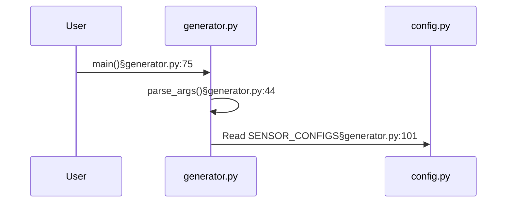
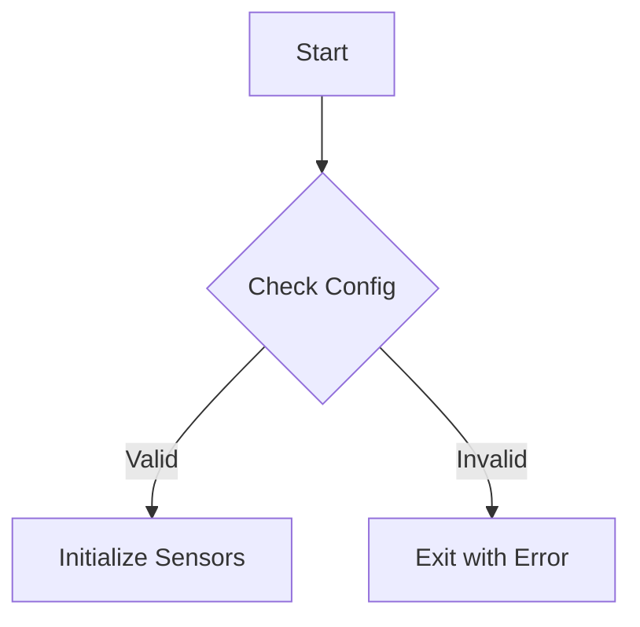

# Theia: Diagram-to-Code Navigation Specification

**Version:** 1.1  
**Last Updated:** 2025-12-17  
**Status:** Draft for Review

## 1. Overview

This specification defines the architecture for interactive sequence diagrams that enable click-to-navigate functionality between diagram elements and source code locations. The goal is reliable, state-driven navigation that survives React re-renders and doesn't depend on fragile DOM manipulation.

### 1.1 Design Principles

1. **State-driven, not DOM-driven**: Navigation logic lives in React state, not injected DOM handlers
2. **Single navigation pathway**: All sources (diagrams, walkthroughs, annotations) use the same navigation function
3. **Graceful degradation**: Unresolvable references are visually distinct and non-blocking
4. **Responsive feedback**: Every interaction has immediate visual acknowledgment

---

## 2. Data Contract: Code Reference Format

### 2.1 Canonical Reference Format

All code references in diagrams MUST follow this format:

```
{description}§{filepath}:{line}
```

**Components:**
- `description`: Human-readable label (e.g., `main()`, `Read SENSOR_CONFIGS`)
- `§` (section sign): Delimiter chosen because it won't appear in code or descriptions
- `filepath`: Path relative to repository root (e.g., `generator.py`, `sensors/base.py`)
- `line`: Line number (1-indexed integer)

**Examples:**
```
main()§generator.py:75
parse_args()§generator.py:44
Read SENSOR_CONFIGS§generator.py:101
Instantiate SensorGenerator§generator.py:102
generator instance§sensors/base.py:27
```

### 2.2 Display vs. Data Separation

The `§` delimiter enables parsing while keeping display clean:
- **Stored in Mermaid**: Full reference with delimiter
- **Displayed to user**: Only the description portion (text before `§`)
- **Used for navigation**: filepath:line portion (text after `§`)

### 2.3 LLM Prompt Template

When requesting diagram generation from Gemini, include this instruction:

```markdown
## Code Reference Format

When labeling sequence diagram messages or activations, use this exact format:
{description}§{filepath}:{line}

Where:
- {description} is a short human-readable label
- § is the literal section sign character (Unicode U+00A7)  
- {filepath} is the file path relative to repository root
- {line} is the line number

Example Mermaid syntax:


IMPORTANT: Every message arrow MUST include a code reference. If you cannot determine the exact line, use your best estimate based on the code structure.
```

### 2.4 Validation Rules

Before rendering, validate all references:

| Check | Action on Failure |
|-------|-------------------|
| Missing `§` delimiter | Treat as non-navigable label |
| File not in PR | Log warning, render as non-navigable |
| Line number invalid | Default to line 1 of the file |
| Path doesn't resolve | Attempt fuzzy match (see §4) |

---

## 3. Architecture: State-Driven Navigation

### 3.1 Why Not DOM Injection?

The current approach fails because:
1. Mermaid SVG rendering is async and timing is unpredictable
2. React re-renders wipe injected handlers
3. SVG text elements may be split across `<tspan>` nodes
4. Zoom/pan operations trigger re-renders

### 3.2 Proposed Architecture

```
┌─────────────────────────────────────────────────────────────────┐
│                         PRContext                                │
│  ┌─────────────────┐  ┌──────────────────┐  ┌────────────────┐  │
│  │ diagramRegistry │  │ navigationTarget │  │ fileSelection  │  │
│  │                 │  │                  │  │                │  │
│  │ Map<diagramId,  │  │ {filepath, line} │  │ {path, scroll} │  │
│  │   DiagramMeta>  │  │ or null          │  │                │  │
│  └────────┬────────┘  └────────▲─────────┘  └───────▲────────┘  │
│           │                    │                     │           │
└───────────┼────────────────────┼─────────────────────┼───────────┘
            │                    │                     │
    ┌───────▼───────┐    ┌───────┴───────┐    ┌───────┴───────┐
    │ DiagramPanel  │    │ useDiagramNav │    │  CodeViewer   │
    │               │───▶│    (hook)     │───▶│               │
    │ Mermaid +     │    │               │    │ scrollToLine  │
    │ clickBindings │    │ resolveRef()  │    │               │
    └───────────────┘    └───────────────┘    └───────────────┘
```

### 3.3 Data Structures

```typescript
// Stored in PRContext
interface DiagramMeta {
  id: string;
  title: string;
  mermaidSource: string;
  references: CodeReference[];
  generatedAt: number;
}

interface CodeReference {
  id: string;                    // Unique ID for this reference
  description: string;           // Human-readable label
  filepath: string;              // Relative path from repo root
  line: number;                  // 1-indexed line number
  resolvedPath: string | null;   // Actual path in PR file tree (after fuzzy match)
  status: 'valid' | 'unresolved' | 'file-not-in-pr';
}

// Navigation state
interface NavigationTarget {
  filepath: string;
  line: number;
  source: 'diagram' | 'walkthrough' | 'annotation' | 'search';
  diagramId?: string;
  referenceId?: string;
}
```

### 3.4 Component Responsibilities

**DiagramParser** (pure function)
- Input: Raw Mermaid source from Gemini
- Output: `{ cleanedSource: string, references: CodeReference[] }`
- Extracts all `§filepath:line` patterns
- Replaces them with `description` only in cleanedSource
- Assigns unique IDs to each reference

**DiagramPanel** (React component)
- Receives parsed diagram data
- Renders Mermaid with `securityLevel: 'loose'` to enable click callbacks
- Uses Mermaid's native click binding syntax (see §3.5)
- Does NOT manipulate DOM post-render

**useDiagramNavigation** (custom hook)
- Exposes `navigateToReference(referenceId: string)`
- Resolves reference to actual file path
- Updates PRContext.navigationTarget
- Triggers CodeViewer scroll

**CodeViewer** (React component)
- Subscribes to PRContext.navigationTarget changes
- Calls `scrollToLine()` when target updates
- Highlights target line temporarily

### 3.5 Mermaid Native Click Binding

Mermaid supports click callbacks natively. Instead of post-render DOM injection, embed click handlers in the Mermaid source:

```mermaid
sequenceDiagram
    participant User
    participant gen as generator.py
    
    User->>gen: main()
    click gen call handleDiagramClick("ref-001")
```

**Implementation approach:**

1. Parse raw Mermaid from Gemini, extract references
2. Transform Mermaid source to inject click bindings
3. Register global `handleDiagramClick` function before render
4. Mermaid calls this function with reference ID on click

```typescript
// Before rendering diagram
window.handleDiagramClick = (refId: string) => {
  const ref = diagramRegistry.get(currentDiagramId)?.references.find(r => r.id === refId);
  if (ref) {
    navigateToReference(ref);
  }
};
```

**Note:** This requires `securityLevel: 'loose'` in Mermaid config.

### 3.6 Hit Area Enhancement

Mermaid's native click binding on participants makes the entire box clickable. However, for **message arrows**, only the text label is clickable by default. This creates a poor UX where users click on arrows and nothing happens.

**Solution: Targeted SVG Enhancement**

After Mermaid renders, enhance message paths with invisible expanded hit areas:

```typescript
function enhanceClickableAreas(svgElement: SVGElement, references: CodeReference[]) {
  // Find all message lines (arrows between participants)
  const messagePaths = svgElement.querySelectorAll('.messageLine0, .messageLine1');
  
  messagePaths.forEach((path, index) => {
    const ref = references[index];
    if (!ref || ref.status !== 'valid') return;
    
    // Create invisible expanded hit area
    const hitArea = path.cloneNode(true) as SVGElement;
    hitArea.setAttribute('stroke-width', '24');
    hitArea.setAttribute('stroke', 'transparent');
    hitArea.setAttribute('stroke-linecap', 'round');
    hitArea.style.cursor = 'pointer';
    hitArea.style.pointerEvents = 'stroke';
    hitArea.classList.add('clickable-ref', `ref-${ref.id}`);
    
    // Insert hit area before the visible path
    path.parentNode?.insertBefore(hitArea, path);
    
    // Attach click handler to hit area
    hitArea.addEventListener('click', () => {
      window.handleDiagramClick(ref.id);
    });
  });
  
  // Enhance participant boxes
  const participants = svgElement.querySelectorAll('.actor');
  participants.forEach(actor => {
    actor.classList.add('clickable-ref');
    actor.style.cursor = 'pointer';
  });
}
```

**Important distinctions from the old DOM injection approach:**

| Old Approach (Fragile) | New Approach (Robust) |
|------------------------|----------------------|
| Parse text content with regex | References pre-extracted during Mermaid source parsing |
| Inject data attributes for navigation | Click handlers call registered callback with known ref ID |
| Must re-run on every render | One-time enhancement after initial render |
| Breaks when text structure changes | Independent of text content structure |

**When to call `enhanceClickableAreas`:**

```typescript
useEffect(() => {
  if (svgRef.current && diagramMeta?.references) {
    enhanceClickableAreas(svgRef.current, diagramMeta.references);
  }
}, [diagramMeta?.id]); // Only re-run when diagram changes, not on every render
```

---

## 4. File Path Resolution

### 4.1 The Problem

Gemini might output paths that don't exactly match the PR file tree:
- `base.py` vs `sensors/base.py`
- `src/generator.py` vs `generator.py`
- Case sensitivity issues

### 4.2 Resolution Strategy

```typescript
function resolveFilePath(
  referencePath: string, 
  prFiles: string[]
): { resolved: string | null; confidence: 'exact' | 'fuzzy' | 'none' } {
  
  // 1. Exact match
  if (prFiles.includes(referencePath)) {
    return { resolved: referencePath, confidence: 'exact' };
  }
  
  // 2. Basename match (single result)
  const basename = referencePath.split('/').pop();
  const basenameMatches = prFiles.filter(f => f.endsWith(`/${basename}`) || f === basename);
  if (basenameMatches.length === 1) {
    return { resolved: basenameMatches[0], confidence: 'fuzzy' };
  }
  
  // 3. Suffix match (for partial paths like "sensors/base.py")
  const suffixMatches = prFiles.filter(f => f.endsWith(referencePath));
  if (suffixMatches.length === 1) {
    return { resolved: suffixMatches[0], confidence: 'fuzzy' };
  }
  
  // 4. Ambiguous or no match
  return { resolved: null, confidence: 'none' };
}
```

### 4.3 Handling Ambiguity

When multiple files could match:
- Log all candidates to console for debugging
- Mark reference as `unresolved`
- Render element as non-clickable with visual indicator (dimmed, no pointer cursor)
- Show tooltip on hover: "Ambiguous reference: multiple matching files"

---

## 5. Navigation Lifecycle

### 5.1 Sequence: Diagram Click to Code Scroll

```
User clicks diagram element
         │
         ▼
┌─────────────────────────────┐
│ Mermaid triggers callback   │
│ handleDiagramClick(refId)   │
└─────────────┬───────────────┘
              │
              ▼
┌─────────────────────────────┐
│ Look up reference in        │
│ diagramRegistry             │
└─────────────┬───────────────┘
              │
              ▼
┌─────────────────────────────┐
│ Check reference.status      │
│ Is it 'valid'?              │
└─────────────┬───────────────┘
              │
     ┌────────┴────────┐
     │                 │
   valid            invalid
     │                 │
     ▼                 ▼
┌──────────┐    ┌──────────────┐
│ Update   │    │ Show toast:  │
│ PRContext│    │ "Cannot      │
│ .navTgt  │    │ navigate"    │
└────┬─────┘    └──────────────┘
     │
     ▼
┌─────────────────────────────┐
│ CodeViewer receives update  │
│ via useEffect subscription  │
└─────────────┬───────────────┘
              │
              ▼
┌─────────────────────────────┐
│ If file differs from        │
│ current: switch file first  │
└─────────────┬───────────────┘
              │
              ▼
┌─────────────────────────────┐
│ scrollToLine(line)          │
│ highlightLine(line, 2000ms) │
└─────────────────────────────┘
```

### 5.2 State Transitions

```typescript
// PRContext actions
type DiagramAction = 
  | { type: 'REGISTER_DIAGRAM'; payload: DiagramMeta }
  | { type: 'NAVIGATE_TO_REF'; payload: { diagramId: string; refId: string } }
  | { type: 'CLEAR_NAVIGATION' }
  | { type: 'RESOLVE_REFERENCES'; payload: { diagramId: string; prFiles: string[] } };
```

### 5.3 Cross-Panel Coordination

The navigation target is the single source of truth. Multiple panels can set it:

| Source | Sets navigationTarget | CodeViewer Response |
|--------|----------------------|---------------------|
| Diagram click | `{ filepath, line, source: 'diagram' }` | Switch file, scroll to line |
| Walkthrough step | `{ filepath, line, source: 'walkthrough' }` | Switch file, scroll to line |
| Annotation click | `{ filepath, line, source: 'annotation' }` | Switch file, scroll to line |
| File tree click | `{ filepath, line: 1, source: 'tree' }` | Switch file, scroll to top |

**Unified Navigation Function**

All navigation sources MUST use this single function to ensure consistent behavior:

```typescript
async function navigateToCode(target: NavigationTarget): Promise<boolean> {
  const startTime = performance.now();
  
  try {
    // 1. Validate target
    const resolvedPath = resolveFilePath(target.filepath, prFiles);
    if (!resolvedPath.resolved) {
      showToast(`Cannot navigate: file "${target.filepath}" not found in PR`);
      logNavigation({ ...target, outcome: 'file_not_found', duration_ms: performance.now() - startTime });
      return false;
    }
    
    // 2. If different file, switch first and wait for load
    if (resolvedPath.resolved !== currentFile) {
      setIsNavigating(true);
      await selectFile(resolvedPath.resolved);
      
      // Wait for CodeViewer to mount and render
      await waitForFileLoad(resolvedPath.resolved);
    }
    
    // 3. Check if line already visible (skip scroll if so)
    if (isLineVisible(target.line, SCROLL_CONFIG.viewportPadding)) {
      highlightLine(target.line, SCROLL_CONFIG.highlightDuration);
      logNavigation({ ...target, outcome: 'success', duration_ms: performance.now() - startTime });
      return true;
    }
    
    // 4. Scroll with animation
    await scrollToLine(target.line, SCROLL_CONFIG);
    
    // 5. Highlight after scroll completes
    highlightLine(target.line, SCROLL_CONFIG.highlightDuration);
    
    logNavigation({ ...target, outcome: 'success', duration_ms: performance.now() - startTime });
    return true;
    
  } catch (error) {
    console.error('Navigation failed:', error);
    showToast('Navigation failed. Please try again.');
    logNavigation({ ...target, outcome: 'error', duration_ms: performance.now() - startTime });
    return false;
    
  } finally {
    setIsNavigating(false);
  }
}

// Helper: Wait for file to be loaded and rendered
function waitForFileLoad(filepath: string, timeout = 2000): Promise<void> {
  return new Promise((resolve, reject) => {
    const startTime = Date.now();
    
    const checkLoaded = () => {
      if (currentFile === filepath && codeViewerRef.current?.isReady) {
        resolve();
        return;
      }
      
      if (Date.now() - startTime > timeout) {
        reject(new Error(`Timeout waiting for file load: ${filepath}`));
        return;
      }
      
      requestAnimationFrame(checkLoaded);
    };
    
    checkLoaded();
  });
}
```

**Critical: File Switch Must Complete Before Scroll**

The most common navigation bug is a race condition:
1. User clicks diagram reference to `config.py:42`
2. Code calls `selectFile('config.py')` 
3. Code immediately calls `scrollToLine(42)`
4. But `generator.py` is still rendered → scroll targets wrong file

The `waitForFileLoad` function prevents this by waiting for:
- `currentFile` state to update
- CodeViewer component to signal readiness

### 5.4 Scroll Behavior Specification

**Configuration:**

```typescript
interface ScrollConfig {
  // Where target line should appear in viewport
  position: 'center' | 'top-third' | 'top';
  
  // Smooth scroll timing
  duration: number;        // ms
  easing: 'ease-out' | 'ease-in-out';
  
  // Don't scroll if line already visible with this padding
  viewportPadding: number; // lines
  
  // How long to highlight the target line
  highlightDuration: number; // ms
}

const SCROLL_CONFIG: ScrollConfig = {
  position: 'top-third',     // Line appears 1/3 from top, context visible above
  duration: 350,             // Fast but smooth
  easing: 'ease-out',        // Quick start, gentle stop
  viewportPadding: 5,        // 5 lines margin before triggering scroll
  highlightDuration: 2000    // 2 second highlight fade
};
```

**Why `top-third` positioning?**

- `top`: Target line at very top—no context above, disorienting
- `center`: Target line centered—wastes vertical space, less code visible
- `top-third`: Target line 1/3 from top—shows preceding context (function signature, comments) while maximizing code below

**Scroll Implementation:**

```typescript
function scrollToLine(line: number, config: ScrollConfig): Promise<void> {
  return new Promise((resolve) => {
    const codeViewer = codeViewerRef.current;
    if (!codeViewer) {
      resolve();
      return;
    }
    
    const lineElement = codeViewer.getLineElement(line);
    if (!lineElement) {
      console.warn(`Line ${line} not found in current file`);
      resolve();
      return;
    }
    
    const viewerRect = codeViewer.getBoundingClientRect();
    const lineRect = lineElement.getBoundingClientRect();
    
    // Calculate target scroll position based on config.position
    let targetOffset: number;
    switch (config.position) {
      case 'top':
        targetOffset = 0;
        break;
      case 'center':
        targetOffset = viewerRect.height / 2;
        break;
      case 'top-third':
        targetOffset = viewerRect.height / 3;
        break;
    }
    
    const currentScroll = codeViewer.scrollTop;
    const lineOffset = lineRect.top - viewerRect.top + currentScroll;
    const targetScroll = lineOffset - targetOffset;
    
    // Animate scroll
    const startScroll = currentScroll;
    const distance = targetScroll - startScroll;
    const startTime = performance.now();
    
    function animateScroll() {
      const elapsed = performance.now() - startTime;
      const progress = Math.min(elapsed / config.duration, 1);
      
      // Easing function
      const easedProgress = config.easing === 'ease-out'
        ? 1 - Math.pow(1 - progress, 3)  // Cubic ease-out
        : progress < 0.5
          ? 4 * progress * progress * progress
          : 1 - Math.pow(-2 * progress + 2, 3) / 2;  // Cubic ease-in-out
      
      codeViewer.scrollTop = startScroll + (distance * easedProgress);
      
      if (progress < 1) {
        requestAnimationFrame(animateScroll);
      } else {
        resolve();
      }
    }
    
    requestAnimationFrame(animateScroll);
  });
}

function isLineVisible(line: number, padding: number): boolean {
  const codeViewer = codeViewerRef.current;
  if (!codeViewer) return false;
  
  const lineElement = codeViewer.getLineElement(line);
  if (!lineElement) return false;
  
  const viewerRect = codeViewer.getBoundingClientRect();
  const lineRect = lineElement.getBoundingClientRect();
  const lineHeight = lineRect.height;
  
  const paddingPx = padding * lineHeight;
  
  return (
    lineRect.top >= viewerRect.top + paddingPx &&
    lineRect.bottom <= viewerRect.bottom - paddingPx
  );
}
```

**Line Highlighting:**

```typescript
function highlightLine(line: number, duration: number) {
  const lineElement = codeViewerRef.current?.getLineElement(line);
  if (!lineElement) return;
  
  // Add highlight class
  lineElement.classList.add('navigation-highlight');
  
  // Remove after duration with fade
  setTimeout(() => {
    lineElement.classList.add('navigation-highlight-fade');
    
    setTimeout(() => {
      lineElement.classList.remove('navigation-highlight', 'navigation-highlight-fade');
    }, 300); // Fade duration
  }, duration);
}
```

```css
.navigation-highlight {
  background-color: var(--highlight-color, rgba(255, 213, 0, 0.3));
  transition: background-color 300ms ease-out;
}

.navigation-highlight-fade {
  background-color: transparent;
}
```

---

## 6. Error Handling

### 6.1 Error Categories

| Error | Detection | User Feedback | Recovery |
|-------|-----------|---------------|----------|
| Gemini omits `§` delimiter | Parse phase | Element renders as non-clickable | None needed |
| File not in PR | Resolution phase | Dimmed element + tooltip | None needed |
| Line exceeds file length | Navigation phase | Navigate to last line | Scroll to EOF |
| Mermaid syntax error | Render phase | Show error message in panel | Offer "View Raw" option |
| Multiple path matches | Resolution phase | Dimmed element + tooltip | Show disambiguation dialog? |

### 6.2 Logging

All navigation attempts should be logged for debugging:

```typescript
interface NavigationLog {
  timestamp: number;
  diagramId: string;
  referenceId: string;
  attemptedPath: string;
  resolvedPath: string | null;
  outcome: 'success' | 'file_not_found' | 'ambiguous' | 'parse_error';
  duration_ms: number;
}
```

---

## 7. Visual Feedback & Interaction States

Immediate visual feedback is critical for navigation UX. Users should never wonder "did that click register?"

### 7.1 Reference Status Visual Encoding

In the rendered diagram, references must be visually distinct based on their resolution status:

| Status | Visual Treatment | Cursor | Interaction |
|--------|-----------------|--------|-------------|
| `valid` | Normal color, subtle glow on hover | `pointer` | Clickable, navigates |
| `unresolved` | 50% opacity, dashed underline | `not-allowed` | Tooltip on hover |
| `file-not-in-pr` | 40% opacity, strikethrough | `not-allowed` | Tooltip on hover |

### 7.2 Interaction State Transitions

```
                    ┌─────────────────────────────────────────┐
                    │              IDLE STATE                  │
                    │  - Normal appearance                     │
                    │  - Pointer cursor (if valid)             │
                    └─────────────────┬───────────────────────┘
                                      │
                           mouse enters element
                                      │
                                      ▼
                    ┌─────────────────────────────────────────┐
                    │             HOVER STATE                  │
                    │  - Brightness increase (1.15x)           │
                    │  - Underline appears                     │
                    │  - Subtle scale (1.02x)                  │
                    │  - Transition: 150ms ease-out            │
                    └─────────────────┬───────────────────────┘
                                      │
                              mouse click
                                      │
                                      ▼
                    ┌─────────────────────────────────────────┐
                    │            ACTIVE STATE                  │
                    │  - Scale down (0.98x) - "press" effect   │
                    │  - Brightness (1.3x)                     │
                    │  - Duration: 100ms                       │
                    └─────────────────┬───────────────────────┘
                                      │
                            click handler fires
                                      │
                                      ▼
                    ┌─────────────────────────────────────────┐
                    │          NAVIGATING STATE                │
                    │  - Pulse animation (200ms)               │
                    │  - Ring/glow effect                      │
                    │  - Maintained until navigation complete  │
                    └─────────────────┬───────────────────────┘
                                      │
                          navigation completes
                                      │
                                      ▼
                    ┌─────────────────────────────────────────┐
                    │           IDLE STATE                     │
                    │  (return to normal)                      │
                    └─────────────────────────────────────────┘
```

### 7.3 CSS Implementation

```css
/* ============================================
   DIAGRAM CLICKABLE ELEMENTS
   ============================================ */

/* Base state for all clickable references */
.mermaid .clickable-ref {
  cursor: pointer;
  transition: all 150ms ease-out;
  transform-origin: center;
}

/* Hover state */
.mermaid .clickable-ref:hover {
  filter: brightness(1.15);
  transform: scale(1.02);
}

/* For text elements specifically */
.mermaid text.clickable-ref:hover {
  text-decoration: underline;
  text-decoration-color: var(--accent-color, #6366f1);
  text-underline-offset: 2px;
  text-decoration-thickness: 2px;
}

/* Active/pressed state */
.mermaid .clickable-ref:active {
  filter: brightness(1.3);
  transform: scale(0.98);
  transition-duration: 100ms;
}

/* Navigating state - element was clicked, navigation in progress */
.mermaid .clickable-ref.navigating {
  animation: navigation-pulse 200ms ease-out;
}

@keyframes navigation-pulse {
  0% {
    filter: brightness(1) drop-shadow(0 0 0 transparent);
  }
  50% {
    filter: brightness(1.4) drop-shadow(0 0 8px var(--accent-color, #6366f1));
  }
  100% {
    filter: brightness(1.15) drop-shadow(0 0 0 transparent);
  }
}

/* ============================================
   UNRESOLVED REFERENCES
   ============================================ */

.mermaid .unresolved-ref {
  opacity: 0.5;
  cursor: not-allowed;
  pointer-events: auto; /* Still need pointer events for tooltip */
}

.mermaid text.unresolved-ref {
  text-decoration: underline dashed;
  text-decoration-color: var(--warning-color, #f59e0b);
}

/* File not in PR - more severe visual treatment */
.mermaid .not-in-pr-ref {
  opacity: 0.4;
  cursor: not-allowed;
}

.mermaid text.not-in-pr-ref {
  text-decoration: line-through;
  text-decoration-color: var(--error-color, #ef4444);
}

/* ============================================
   PARTICIPANT BOXES (Mermaid sequence diagrams)
   ============================================ */

.mermaid .actor {
  transition: all 150ms ease-out;
}

.mermaid .actor.clickable-ref:hover {
  filter: brightness(1.1);
}

.mermaid .actor.clickable-ref:hover rect {
  stroke-width: 3px;
  stroke: var(--accent-color, #6366f1);
}

/* ============================================
   MESSAGE ARROWS
   ============================================ */

/* Expanded hit area (invisible) */
.mermaid .message-hitarea {
  stroke: transparent;
  stroke-width: 24px;
  stroke-linecap: round;
  pointer-events: stroke;
  cursor: pointer;
}

.mermaid .message-hitarea:hover + .messageLine0,
.mermaid .message-hitarea:hover + .messageLine1 {
  stroke-width: 3px;
  stroke: var(--accent-color, #6366f1);
}

/* ============================================
   CODE VIEWER - TARGET LINE HIGHLIGHT
   ============================================ */

.code-line.navigation-highlight {
  background-color: var(--highlight-bg, rgba(99, 102, 241, 0.2));
  box-shadow: inset 4px 0 0 var(--accent-color, #6366f1);
  transition: background-color 300ms ease-out, box-shadow 300ms ease-out;
}

.code-line.navigation-highlight-fade {
  background-color: transparent;
  box-shadow: inset 4px 0 0 transparent;
}

/* Gutter indicator for navigated line */
.code-line.navigation-highlight .line-number::before {
  content: '→';
  position: absolute;
  left: -1.5em;
  color: var(--accent-color, #6366f1);
  font-weight: bold;
  animation: arrow-fade 2s ease-out forwards;
}

@keyframes arrow-fade {
  0%, 80% { opacity: 1; }
  100% { opacity: 0; }
}

/* ============================================
   LOADING/NAVIGATING INDICATOR
   ============================================ */

.diagram-panel.navigating::after {
  content: '';
  position: absolute;
  bottom: 8px;
  right: 8px;
  width: 16px;
  height: 16px;
  border: 2px solid var(--accent-color, #6366f1);
  border-top-color: transparent;
  border-radius: 50%;
  animation: spin 600ms linear infinite;
}

@keyframes spin {
  to { transform: rotate(360deg); }
}
```

### 7.4 Tooltip Content for Non-Navigable References

```typescript
function getReferenceTooltip(ref: CodeReference): string {
  switch (ref.status) {
    case 'valid':
      return `Click to navigate to ${ref.filepath}:${ref.line}`;
    
    case 'unresolved':
      return `Cannot navigate: "${ref.filepath}" matches multiple files in this PR`;
    
    case 'file-not-in-pr':
      return `Cannot navigate: "${ref.filepath}" is not part of this PR`;
    
    default:
      return '';
  }
}
```

### 7.5 Bidirectional Highlighting (Future Enhancement)

When user is viewing code that corresponds to a diagram reference, highlight the diagram element:

```typescript
// In CodeViewer, track which line is centered in viewport
useEffect(() => {
  const handleScroll = debounce(() => {
    const centerLine = getCenterVisibleLine();
    const matchingRef = findReferenceForLine(currentFile, centerLine);
    
    if (matchingRef) {
      setHighlightedDiagramRef(matchingRef.id);
    } else {
      setHighlightedDiagramRef(null);
    }
  }, 100);
  
  codeViewerRef.current?.addEventListener('scroll', handleScroll);
  return () => codeViewerRef.current?.removeEventListener('scroll', handleScroll);
}, [currentFile]);
```

```css
/* Diagram element highlighted because corresponding code is visible */
.mermaid .clickable-ref.code-visible {
  filter: brightness(1.1);
  outline: 2px solid var(--accent-color, #6366f1);
  outline-offset: 2px;
}
```

---

## 8. Implementation Checklist

### Phase 1: Core Infrastructure
- [ ] Define TypeScript interfaces for DiagramMeta, CodeReference, NavigationTarget
- [ ] Add diagramRegistry and navigationTarget to PRContext
- [ ] Implement DiagramParser with reference extraction (§ delimiter parsing)
- [ ] Implement resolveFilePath with fuzzy matching
- [ ] Add navigation logging infrastructure

### Phase 2: Mermaid Integration  
- [ ] Configure Mermaid with `securityLevel: 'loose'`
- [ ] Implement Mermaid source transformation to inject click bindings
- [ ] Set up global handleDiagramClick callback
- [ ] Implement enhanceClickableAreas for expanded hit zones
- [ ] Test click handling survives re-renders

### Phase 3: Navigation Flow
- [ ] Implement unified `navigateToCode` function
- [ ] Implement `waitForFileLoad` with timeout handling
- [ ] Implement `isLineVisible` viewport check
- [ ] Implement `scrollToLine` with configurable easing and positioning
- [ ] Implement `highlightLine` with fade animation
- [ ] Wire CodeViewer to subscribe to navigationTarget

### Phase 4: Visual Feedback
- [ ] Add CSS for clickable-ref hover/active/navigating states
- [ ] Add CSS for unresolved and not-in-pr reference states
- [ ] Implement tooltips for non-navigable references
- [ ] Add navigation-in-progress indicator
- [ ] Add code line highlight with gutter arrow

### Phase 5: Error Handling & Polish
- [ ] Implement error toasts for failed navigation
- [ ] Add comprehensive navigation logging
- [ ] Test edge cases (missing files, ambiguous paths, large diagrams)
- [ ] Test file-switch-then-scroll race condition is resolved
- [ ] Performance test with 50+ reference diagrams

### Phase 6: Walkthrough & Annotation Integration
- [ ] Ensure walkthroughs use unified `navigateToCode` function
- [ ] Ensure annotations use unified `navigateToCode` function
- [ ] Test cross-panel navigation coordination
- [ ] Verify highlight visibility across all navigation sources

---

## 9. Testing Strategy

### 9.1 Unit Tests

- DiagramParser correctly extracts references from various Mermaid syntaxes
- resolveFilePath handles exact, fuzzy, and ambiguous cases
- Reference validation catches all error categories

### 9.2 Integration Tests

- Click on valid reference → CodeViewer scrolls to correct line
- Click on unresolved reference → Toast appears, no navigation
- Diagram re-render → Click handlers still work
- File switch during navigation → Correct file loads before scroll

### 9.3 E2E Test Scenarios

1. Load PR → Generate diagram → Click reference → Verify correct file/line
2. Generate diagram with file not in PR → Verify graceful degradation
3. Rapid clicks on multiple references → Verify no race conditions
4. Zoom/pan diagram → Verify clicks still work

---

## 10. Migration Path

To migrate from current DOM injection approach:

1. **Keep both systems temporarily**: Add feature flag `USE_STATE_DRIVEN_NAV`
2. **Implement new system behind flag**: All new code in separate files
3. **A/B test**: Compare reliability metrics between approaches
4. **Remove old system**: Once new system proves stable

---

## Appendix A: Complete LLM Prompt Template for Diagram Generation

When requesting diagram generation from Gemini, use this complete prompt structure:

```markdown
You are generating a Mermaid sequence diagram for a code review tool. The diagram will be interactive—users can click on elements to navigate to the corresponding code.

## Available Files in This PR

${prFiles.map(f => `- ${f.path} (${f.status}: +${f.additions}/-${f.deletions})`).join('\n')}

## Code Reference Format (CRITICAL)

Every message, activation, and note that references code MUST use this exact format:

{description}§{filepath}:{line}

Where:
- {description} is a short human-readable label (what the code does)
- § is the literal section sign character (Unicode U+00A7, copy from here: §)
- {filepath} is the file path EXACTLY as shown in "Available Files" above
- {line} is the line number (1-indexed)

### Examples of Correct Format:
✓ main()§generator.py:75
✓ Parse CLI arguments§generator.py:44
✓ Read config file§config.py:101
✓ Instantiate sensor§sensors/base.py:27

### Examples of Incorrect Format:
✗ main() (generator.py:75)     ← Wrong delimiter
✗ main()§generator:75          ← Missing .py extension
✗ main()§src/generator.py:75   ← Path doesn't match PR files
✗ main()                       ← Missing code reference entirely

## Diagram Requirements

1. Generate a Mermaid sequence diagram showing: ${diagramRequest}

2. Use participant aliases for cleaner display:
   - participant gen as generator.py
   - participant cfg as config.py
   
3. EVERY message arrow MUST include a code reference using the § format

4. If you cannot determine the exact line number, use your best estimate based on function definitions or logical code sections

5. Do NOT include the § references in participant definitions, only in messages

## Output Format

Return ONLY the Mermaid code block, no explanations:

```mermaid
sequenceDiagram
    participant U as User
    participant gen as generator.py
    ...
```

## Context

PR Title: ${prTitle}
PR Description: ${prDescription}

${selectedCode ? `Currently Selected Code:\n\`\`\`\n${selectedCode}\n\`\`\`` : ''}
```

### Validation After LLM Response

Before rendering, validate the LLM output:

```typescript
function validateDiagramOutput(
  mermaidSource: string, 
  prFiles: string[]
): { valid: boolean; errors: string[]; warnings: string[] } {
  const errors: string[] = [];
  const warnings: string[] = [];
  
  // Extract all references
  const refPattern = /§([^:]+):(\d+)/g;
  let match;
  
  while ((match = refPattern.exec(mermaidSource)) !== null) {
    const [, filepath, lineStr] = match;
    const line = parseInt(lineStr, 10);
    
    // Check if file exists in PR
    const resolved = resolveFilePath(filepath, prFiles);
    if (resolved.confidence === 'none') {
      errors.push(`Reference to unknown file: ${filepath}`);
    } else if (resolved.confidence === 'fuzzy') {
      warnings.push(`Fuzzy match: "${filepath}" → "${resolved.resolved}"`);
    }
    
    // Check line number is reasonable
    if (line < 1) {
      errors.push(`Invalid line number: ${line} in ${filepath}`);
    }
  }
  
  // Check for references using old format
  const oldFormatPattern = /\([\w/.]+\.py:\d+\)/g;
  if (oldFormatPattern.test(mermaidSource)) {
    errors.push('Diagram uses old (file:line) format instead of §file:line format');
  }
  
  return {
    valid: errors.length === 0,
    errors,
    warnings
  };
}
```

## Appendix B: Mermaid Click Binding Examples

### Sequence Diagram with Click Bindings

```mermaid
sequenceDiagram
    participant U as User
    participant G as generator.py
    participant C as config.py
    participant B as sensors/base.py
    
    U->>G: main()
    click G call handleDiagramClick("ref-001")
    
    G->>G: parse_args()
    click G call handleDiagramClick("ref-002")
    
    G->>C: Read SENSOR_CONFIGS
    click C call handleDiagramClick("ref-003")
    
    loop For each sensor type
        G->>B: Instantiate SensorGenerator
        click B call handleDiagramClick("ref-004")
    end
```

### Flowchart with Click Bindings



---

## Appendix C: Reference ID Generation

Reference IDs should be deterministic for caching:

```typescript
function generateRefId(diagramId: string, filepath: string, line: number): string {
  const hash = simpleHash(`${diagramId}:${filepath}:${line}`);
  return `ref-${hash.slice(0, 8)}`;
}

function simpleHash(str: string): string {
  let hash = 0;
  for (let i = 0; i < str.length; i++) {
    const char = str.charCodeAt(i);
    hash = ((hash << 5) - hash) + char;
    hash = hash & hash;
  }
  return Math.abs(hash).toString(16);
}
```

This ensures the same reference in the same diagram always gets the same ID, enabling caching and comparison.