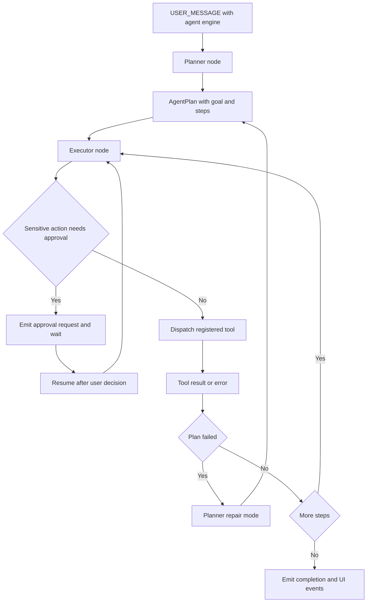

# Agent Planner and Executor architecture

Agent mode is the tool-using engine behind Theia's deeper review actions. `TheiaAgent` in `src/modules/core/Agent.ts` builds a LangGraph state machine whose explicit handoff is the `AgentPlan` stored in `AgentState.plan`. The Planner creates the plan; the Executor advances steps and invokes registered tools.

*This control flow is grounded in `Agent.ts`, `plannerNode.ts`, `executorNode.ts`, `toolRegistry.ts`, and `ApprovalRequest.tsx`.*

## Planner contract

`plannerNode.ts` asks Gemini to submit a structured `submit_plan` function call containing a goal and step descriptions. `submit_plan` is deliberately local to the Planner and is not part of the Executor registry. If structured output is unavailable or malformed, `planJsonParser.ts` provides the JSON/text fallback parsing path. Planner input includes the active file, viewport, focused line, selected code, view mode, repository context, and app mode; the prompt explicitly tells the model not to guess filenames or line numbers.

A failed plan enters repair mode. The Planner emits `REPAIR_MODE`, receives the last error and failed step, and is instructed to diagnose first, avoid repeating the same failing tool invocation, and produce a recovery plan.

## Executor and tools

The Executor consumes the plan object and dispatches actions through `toolRegistry.ts`. The current Agent architecture documents tools for searching and reading the PR, writing files, running terminal commands, navigating to code, switching tabs, changing diff mode, and generating diagrams. Tool implementations communicate with the rest of the application through EventBus events and services rather than directly mutating the React tree.

The Planner and Executor share the plan object but receive their other dependencies through small runtime parameters. This decomposition was recently introduced in the repository history to make planner, executor, parser, and registry behavior independently testable; preserve that explicit boundary when changing the graph.

## Approval and failure behavior

Sensitive actions use a `PendingAction` and are surfaced by `ApprovalRequest.tsx`. Approval is a human-in-the-loop boundary, not a replacement for runtime limits: `WebContainerService` still receives command and argument payloads and executes them in the browser sandbox. Errors feed the plan's failure state and can trigger repair planning. EventBus error handling and asynchronous ordering should be treated carefully because subscribers are not a transactional workflow.

## Change guidance

Start with the focused tests in `tests/unit/core/agent/`, especially planner, executor, parser, and tool registry tests. Update the shared types in `src/modules/core/agent/types.ts` and planner types only with all graph and test consumers in view. Verify both structured function-call output and fallback text parsing. For changes that emit UI or runtime events, run the EventBus and Playwright neural-loop coverage described in [testing and quality gates](../testing/quality-gates.md).

The Agent routes through the application control plane in the [architecture overview](../architecture/overview.md) and sends shell/runtime work to [runtime and integrations](../runtime-and-integrations.md).
