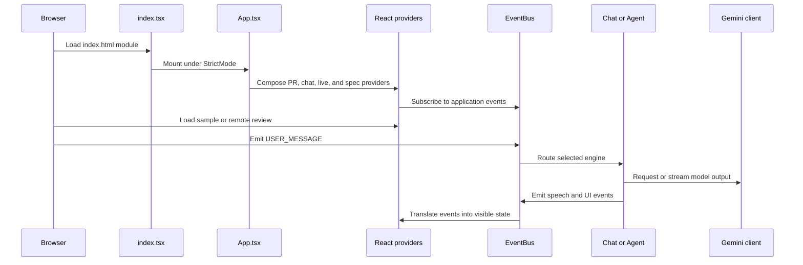

# Theia architecture overview

Theia has one browser application tree and no backend server. `index.html` loads `src/index.tsx`, which mounts `App.tsx` under `React.StrictMode`. `App.tsx` composes the review shell and providers for specifications, PR state, chat, and live voice.

*This flow shows the browser startup, provider composition, event routing, and Gemini boundary grounded in `src/index.tsx`, `src/App.tsx`, `src/contexts/`, and `src/modules/core/`.*

## Control-plane design

`src/modules/core/EventBus.ts` exports a singleton pub/sub bus used by chat engines, UI state, voice, navigation, and runtime services. It retains the last 100 events for observability. `ChatContext.tsx` subscribes to all events and translates events such as `AGENT_SPEAK`, `AGENT_NAVIGATE`, `AGENT_TAB_SWITCH`, `AGENT_DIFF_MODE`, approval requests, and session restoration into React-facing effects.

The bus is intentionally decoupled from component ownership: Agent code emits typed events rather than manipulating React state. `UserContextMonitor.tsx` emits `USER_ACTIVITY`; navigation and tab-switch events are suppressed for three seconds after tracked activity so Agent actions do not unexpectedly steal focus.

## Main boundaries

- `components/` renders the workspace: file tree, code viewer, chat, annotations, specs, diagrams, runtime terminal, and whiteboard.
- `contexts/` owns presentation state and subscriptions.
- `modules/core/` owns events, chat engines, model access, tracing, and planning.
- `modules/ingestion/` and `services/github.ts` load GitHub data; [review lifecycle](../workflows/review-lifecycle.md) describes that flow.
- `modules/runtime/` translates Agent command events into WebContainer execution; [runtime and integrations](../runtime-and-integrations.md) covers the boundary.
- `modules/persistence/` stores review artifacts in browser storage.
- `modules/navigation/` resolves `file:line` references and lazy repository files.
- `services/` contains Linear, voice, diagram, context-brief, and specification services.

## Chat routing

Every user turn includes `engine: 'simple' | 'agent'`. Simple Chat replays its transcript into a streaming Gemini request and has no tools. Agent mode runs the Planner → Executor graph described in [Agent architecture](../agent/architecture.md). Both use the lazy `getGenAI()` client, which is why sample browsing can work without an API key until an AI-backed feature is invoked.

## Maintenance notes

Event names and payloads in `src/modules/core/types.ts` are shared contracts. Changes to them can affect contexts, runtime, voice, navigation, tests, and Agent tools simultaneously. `ChatContext.tsx` also imports engine singletons for their EventBus subscriptions; preserve that initialization behavior when refactoring module loading.
