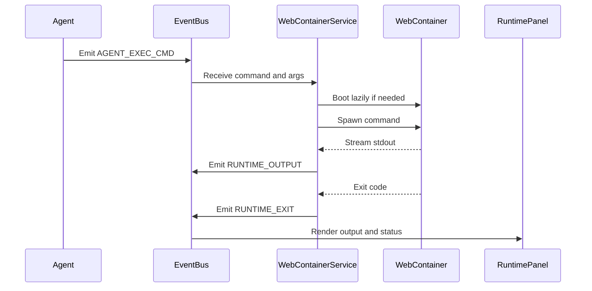

# Runtime and integrations

Theia deliberately keeps integrations in the browser. There is no backend proxy in this repository, so Vite environment values and browser APIs are part of the runtime boundary.

## AI and credentials

`src/modules/core/genaiClient.ts` lazily constructs one `GoogleGenAI` client from `VITE_GEMINI_API_KEY`. Lazy construction allows booting and loading the sample PR without a key; Chat, Agent, live voice, diagram generation, specification atomization, and context-brief generation need Gemini when those features execute.

`src/lib/credentials.ts` handles `VITE_GITHUB_TOKEN` and `VITE_LINEAR_API_KEY` with their documented local-storage behavior. `VITE_GITHUB_TOKEN` is optional for public GitHub access and raises rate limits. Linear issue linking uses `VITE_LINEAR_API_KEY`. Gemini and Google Cloud values are read directly by their callers rather than through `credentials.ts`; do not assume a storage fallback that the source does not provide.

## Browser runtime

`WebContainerService.ts` is the Agent's execution leg. It subscribes to `AGENT_EXEC_CMD` and `SYSTEM_FILE_SYNC`, boots `@webcontainer/api` lazily, mounts files, spawns commands, streams stdout as `RUNTIME_OUTPUT`, and emits `RUNTIME_EXIT` and `RUNTIME_READY`. `teardown()` is explicit. The source does not show command timeouts, output quotas, cancellation, or resource limits, so these are important safety questions for production changes.

*This sequence is based on the event subscriptions and `execute()` implementation in `src/modules/runtime/WebContainerService.ts`.*

## Other integrations

- `src/services/github.ts` calls GitHub metadata, pull-request, tree, and raw-content endpoints; ingestion and caching are described in [review lifecycle](workflows/review-lifecycle.md).
- `src/services/linear.ts` and `LinearModal.tsx` provide optional issue linking.
- `src/services/diagramAgent.ts` generates Mermaid content; `components/Diagrams/MermaidRenderer.tsx` renders it.
- `src/services/VoiceService.ts` uses the browser Web Speech API for normal narration. The architecture source states that current call sites do not enable Cloud TTS by default, so narration does not require a Google Cloud key.
- `vite.config.ts` configures the development server on port 5173, binds to `0.0.0.0`, adds cross-origin isolation headers for browser runtime functionality, and aliases `node:async_hooks` to a browser polyfill.

## Deployment cautions

Client-side API keys are observable by the browser and are not a server-side secret boundary. Production deployments need an intentional quota, origin, and abuse-control strategy. The WebContainer is browser-local rather than a server execution environment; its commands and mounted files should be treated as user-session runtime state.

The [Agent architecture](agent/architecture.md) explains why runtime commands are emitted, while the [architecture overview](architecture/overview.md) explains how those events traverse the application.
