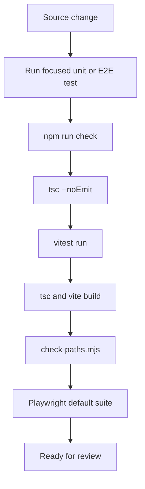

# Testing and quality gates

The repository's authoritative local gate is `npm run check`:

```text
typecheck -> Vitest unit tests -> production build -> relative-import checker -> Playwright
```

The command is implemented as `&&` chaining in `package.json`, so it stops at the first failure. Run the smallest relevant test while iterating, then run the full gate before handoff.

## Coverage map

- `tests/unit/` contains browser-free Vitest tests for Agent planning and execution, parsing, tools, contexts, services, GitHub ingestion, runtime helpers, diagrams, reports, requirements, and path validation.
- `tests/boot-smoke.spec.ts` proves the no-key, offline sample path: the app mounts, the sample PR loads, and representative files render.
- `tests/neural-loop.spec.ts` checks EventBus exposure and history, user-message propagation, Agent speech, navigation, tab switching, diff-mode control, and focus-lock behavior.
- `tests/quarantine/` contains older Playwright specs that depend on real Gemini, Linear, or network services and are excluded from the default deterministic run. Their existence is evidence of broader intended behavior, not proof that it is currently green.



*The sequence mirrors `package.json` scripts and the test organization documented by `README.md`.*

## Operational evidence and risks

`QA_LOG.md` records unresolved Agent planning behavior (`QA-001`) and Gemini quota/rate-limit concerns (`ENV-001`). Treat these as known risks when changing the Agent or model configuration. The repository has a GitHub workflow for OpenWiki updates, but the inspected workflow does not enforce the application check gate; local validation remains a contributor responsibility.

## Change guidance

For Agent changes, begin with `tests/unit/core/agent/` and then run `tests/neural-loop.spec.ts` because Agent output crosses the EventBus into UI state. For ingestion changes, use GitHub and PR-source unit tests plus the boot smoke test. For runtime changes, cover command/event behavior without assuming a real WebContainer is available in unit tests. For UI layout changes, run the offline Playwright suite and inspect the quarantined test notes before re-enabling any network-dependent scenario.

The [Agent architecture](../agent/architecture.md) identifies the planner and executor contracts that need focused coverage. The [review lifecycle](../workflows/review-lifecycle.md) identifies cache and persistence invariants.
