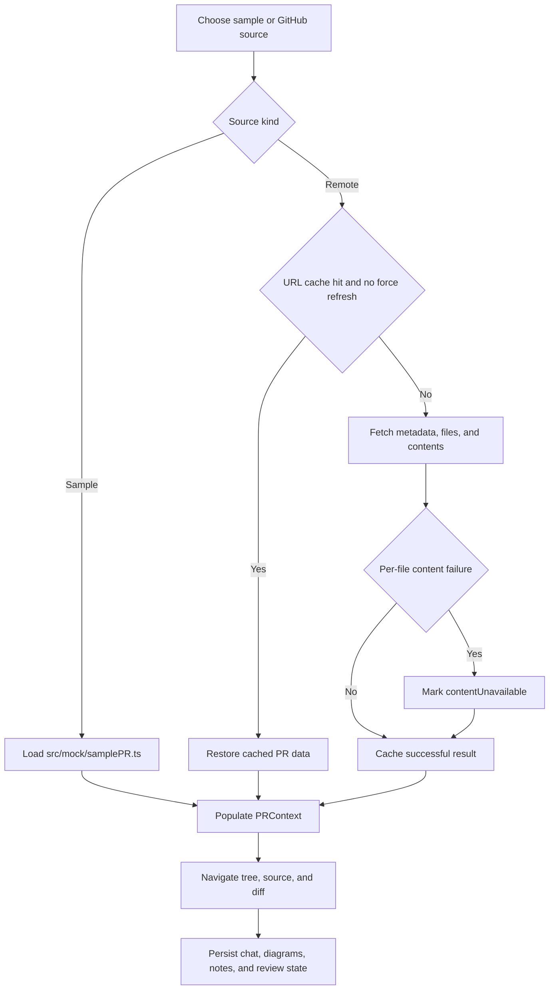

# Review loading and persistence lifecycle

The review workspace can start from the local sample fixture or from a GitHub pull request or repository URL. `PRSourceService` is the orchestration boundary; `src/services/github.ts` performs REST and raw-content retrieval, while `PRContext` exposes the resulting tree, selection, files, and diff state to the UI.

*This flow is based on `PRSourceService.ts`, `github.ts`, `PRContext.tsx`, `StorageService.ts`, and `mock/samplePR.ts`.*

## Remote loading rules

`PRSourceService.load()` first checks a URL-derived `localStorage` cache unless `forceRefresh` is requested. It distinguishes PR and repository URLs. PR loading fetches metadata, paginates changed files, retrieves old and new contents in batches of 20, and caps the file list at 1,000. A failure to retrieve one file's content is represented as `contentUnavailable` rather than as an empty file or a failed entire review.

Successful remote results are cached and added to a recent-history list capped at five items. PR-level failures are not treated as successful cache entries. Public GitHub access works without a token subject to rate limits; `VITE_GITHUB_TOKEN` can raise limits and support private repositories. Repository mode supports lazy or “ghost” files through navigation services rather than eagerly loading every file.

## Review state

`PRContext` owns loaded PR data, selected file, file-tree navigation, and diff/source presentation. The domain types in `src/types/domain.ts` include `PRData`, `FileChange`, `RepoNode`, `LazyFile`, annotations, diagrams, notes, and code references. This domain model supports both changed-file PR review and broader repository exploration.

## Browser persistence

`StorageService` serializes browser-local state with defensive read fallbacks. It stores Agent state, per-PR verification state, diagrams, chat history, and whiteboard notes. Persistence is local to the browser and is not a server-side collaboration system. The source shows versioned storage keys and JSON fallback behavior, but not a quota, expiry, migration, or cross-session isolation policy; treat those as operational gaps rather than assumed guarantees.

## Change guidance

When modifying ingestion, test cache-hit, force-refresh, pagination, partial-content, and sample paths in `tests/unit/modules/` and `tests/unit/services/`. When changing domain shape or storage keys, inspect consumers in `contexts/`, `components/`, and `StorageService.ts` together. Keep the no-key sample path passing: it is the deterministic product entrypoint verified by `tests/boot-smoke.spec.ts`.

The [architecture overview](../architecture/overview.md) explains how loaded state enters the EventBus-driven application, while [runtime and integrations](../runtime-and-integrations.md) covers the external API and credential boundaries.
